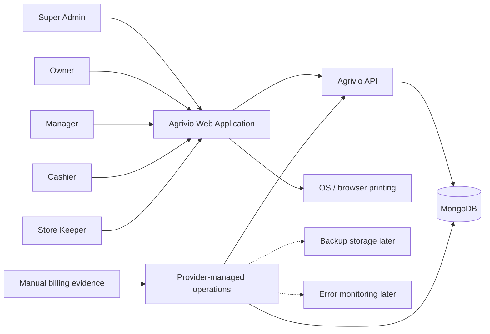
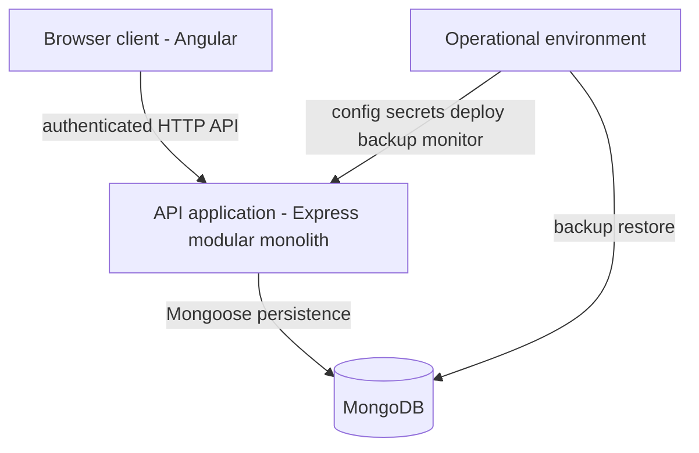
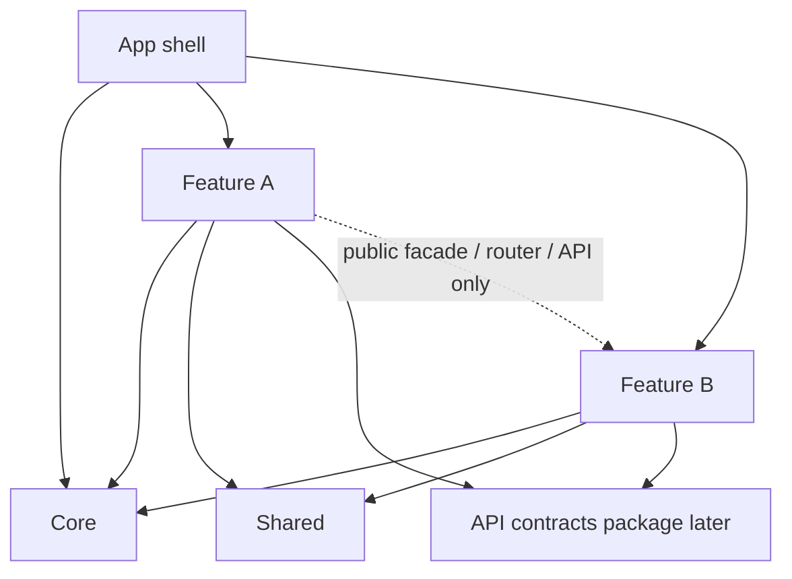
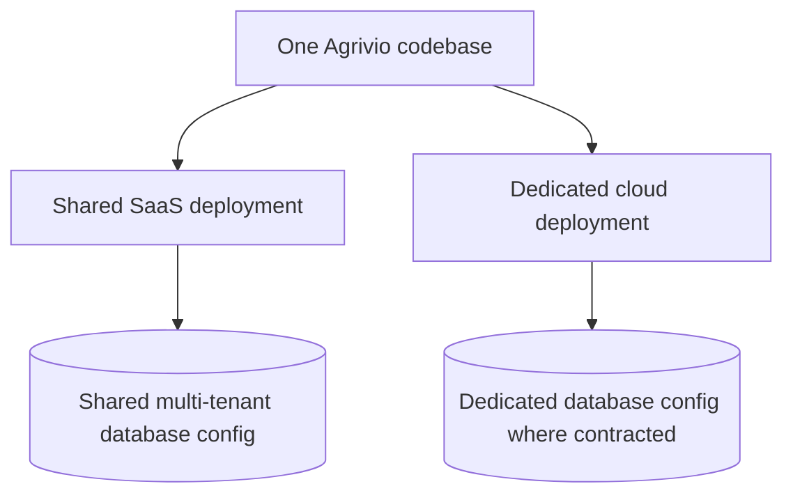

# Architecture

Document status: Frozen for Release 1  
Current version: 1.0  
Last updated: 2026-08-04  
Approval status: Approved for Phase 1 continuation

## Document Authority

| Concern | Authoritative document |
| --- | --- |
| What Release 1 must provide | Frozen [PRD.md](PRD.md) |
| Business behaviour and formulas | Frozen [BUSINESS_RULES.md](BUSINESS_RULES.md) |
| Domain terminology | Frozen [DOMAIN_GLOSSARY.md](DOMAIN_GLOSSARY.md) |
| Finalized product and technical decisions | [PROJECT_DECISIONS.md](PROJECT_DECISIONS.md) |
| Release 1 boundary | [RELEASE_1_SCOPE.md](RELEASE_1_SCOPE.md) |
| How the system is structured | This document |
| Module ownership and dependencies | [MODULE_BOUNDARIES.md](MODULE_BOUNDARIES.md) |
| Target repository layout | [REPOSITORY_STRUCTURE.md](REPOSITORY_STRUCTURE.md) |

This document defines how Agrivio will be structured to support frozen product requirements and business rules. It does not add product scope, change business rules, define schemas, define APIs, or create implementation.

P1-04 does not create application code, frameworks, packages, source folders, CI, or infrastructure.

---

## 1. Architecture Goals

* Strict tenant isolation
* Correct atomic financial and stock workflows
* Explicit module ownership
* No circular business-module dependencies
* No client-specific code forks
* Same codebase for shared SaaS and dedicated cloud deployments
* Maintainable modular-monolith boundaries
* Testable business logic
* Traceable stock and financial changes
* Consistent authorization enforcement
* Scalable organization, branch, warehouse, product, and transaction volumes
* Clear separation between frontend, backend, persistence, and infrastructure
* Ability to evolve modules without a broad rewrite
* Clear migration path if a module later needs extraction
* No premature distributed-system complexity

Release 1 does not use microservices, event sourcing, CQRS, distributed transactions, or multiple databases per business module.

---

## 2. System Context

### Actors

* Super Admin
* Owner
* Manager
* Cashier
* Store Keeper

### System

* Agrivio web application (Angular browser client)
* Agrivio API (Node.js / Express modular monolith)
* MongoDB database
* Provider-managed production operations

### External boundaries

Release 1 may interact operationally with:

* Browser printing through OS-configured printers
* Manual billing evidence for bank transfer, JazzCash, and Easypaisa
* Backup storage selected in a later deployment task
* Error-monitoring provider selected later

Release 1 does not invent a payment gateway, SMS provider, WhatsApp integration, email automation, cloud provider, queue provider, cache provider, object-storage provider, or accounting integration.



---

## 3. Container Architecture

### Browser client

Responsibilities:

* Render the Angular web interface
* Capture user intent
* Perform client-side form validation for usability
* Show loading, empty, error, permission, and validation states
* Send authenticated API requests
* Show only permitted navigation and controls
* Use browser printing

The browser is not the authorization boundary.

### API application

Responsibilities:

* Authentication
* Permission enforcement
* Tenant isolation
* Branch and warehouse scope enforcement
* Request validation
* Business-rule execution
* Atomic transaction orchestration
* Persistence access
* Audit creation
* Report generation
* Import orchestration
* In-app alert data
* Operational logging

### MongoDB

Responsibilities:

* Persistent operational data
* Transaction snapshots
* Stock movements
* Ledger effects
* Account movements
* Audit events
* Subscription state
* Import and correction history

Schemas and collection names are not defined in P1-04.

### Operational environment

Responsibilities:

* Configuration
* Secrets
* Backups
* Restore operations
* Health monitoring
* Error monitoring
* Deployment

Exact hosting topology remains unresolved.

Operational database access boundary:

* Operations may access database infrastructure for controlled backup, restore, health, migration, and authorized emergency procedures.
* Operations must not bypass application services for normal business transactions.
* Direct mutation of posted sales, purchases, stock, ledgers, payments, accounts, or audit records is prohibited as a normal operational workflow.
* Emergency repair requires an authorized incident procedure, recovery plan, incident record, and reconciliation.
* Detailed incident runbooks are out of scope for P1-04.



---

## 4. Modular Monolith Structure

Agrivio is a single deployable API process containing explicitly bounded business modules. Modules communicate through public interfaces inside one process and one database.

Canonical module catalog, ownership, and dependency rules live in [MODULE_BOUNDARIES.md](MODULE_BOUNDARIES.md).

Target folder layout lives in [REPOSITORY_STRUCTURE.md](REPOSITORY_STRUCTURE.md).

---

## 5. Frontend Architecture

The Angular frontend uses feature-based organization.

### App shell

* Application bootstrap
* Main routing
* Layout composition
* Global loading behaviour
* Global error presentation

### Core

Application-wide singleton infrastructure only:

* Authentication session
* HTTP client configuration
* Error handling
* Route guards
* Permission-context access
* Application configuration
* Layout services
* Logging integration

Core must not contain business-feature components.

### Features

Each product area owns its pages, feature components, feature routes, forms, feature services, data-access layer, feature models, feature-specific validation, and feature tests.

Feature modules must not import internal files from another feature.

Cross-feature interaction must use:

* Published feature facade
* Approved shared service
* Router navigation
* Stable API contract

### Shared

Genuinely reusable UI components, form controls, pipes, directives, formatting utilities, accessibility helpers, and generic layout primitives only.

Shared must not contain sales, inventory, customer, or permission business rules, or feature-specific API orchestration.

### State management

Use local feature state by default. P1-04 does not require a global state-management library. A later task may introduce shared state only where a documented cross-feature need exists.

Frontend permission checks improve usability only. The backend remains authoritative.



---

## 6. Backend Architecture

The backend is a modular monolith. Each business module uses these logical layers:

### Routes

* Register HTTP entry points
* Attach authentication, permission checks, and scope checks
* Attach validation
* Forward to controllers

Routes must not contain business logic.

### Validation

* Validate request shape, required fields, and basic formats
* Reject malformed input before controller execution

Validation must not replace domain rules in services.

### Controllers

* Translate validated requests into service calls
* Extract authenticated context
* Return success or error responses
* Remain thin

Controllers must not query Mongoose directly, calculate stock or ledgers, calculate weighted-average cost, post transactions, decide permissions, or orchestrate multi-module business workflows.

### Application services

* Execute use cases
* Apply business rules
* Coordinate module interfaces
* Define transaction boundaries
* Enforce business invariants
* Produce auditable outcomes

Application services are the primary business-workflow owners.

### Repositories

* Encapsulate persistence access
* Enforce tenant-scoped access
* Support transaction/session context
* Map persisted records to module-level data structures
* Expose business-oriented persistence operations

A module must not import another module’s repository.

### Mongoose persistence

* MongoDB persistence mapping
* Index definitions
* Persistence validation
* Query implementation

Exact schemas and indexes belong in P1-05.

---

## 7. Request Lifecycle

```text
HTTP request
→ authentication
→ permission enforcement
→ organization scope
→ branch/warehouse scope
→ request validation
→ controller
→ application service
→ module interfaces/repositories
→ MongoDB transaction
→ audit and response
```

Required backend request path:

```text
Route
→ authentication and permission enforcement
→ tenant, branch, and warehouse scope enforcement
→ request validation
→ controller
→ application service
→ repository or module interface
→ Mongoose persistence
```

---

## 8. Transaction Lifecycle

Business-critical workflows execute synchronously inside one database transaction where required by frozen business rules and PRD atomicity requirements.

Rules:

* The use-case-owning application service controls the transaction boundary.
* Participating module interfaces accept the shared transaction context.
* Participating modules must not commit independently.
* A failed workflow must roll back all authoritative effects.
* Audit events required by the transaction participate in the same transaction.
* After-commit actions must not determine authoritative stock or financial state.

Mongoose session APIs are not defined in P1-04.

---

## 9. Tenant Isolation

* Every tenant-owned record belongs to exactly one organization.
* Authenticated organization context is resolved before business execution.
* Every tenant-owned repository operation requires organization scope.
* Organization scope must not be an optional repository filter.
* Record lookup by ID must also verify organization ownership.
* Branch and warehouse references must belong to the same organization.
* Cross-organization relations are prohibited unless explicitly platform-owned.
* Super Admin platform operations are explicitly separated from organization operations.
* Platform authorization must not silently bypass organization rules.
* Background or scheduled operations must iterate organizations explicitly.
* Reports, exports, imports, and audit queries remain tenant-scoped except explicitly authorized platform operations.
* Cache keys and file exports, if introduced later, must include organization ownership and access controls.

Architecture tests must later verify that repository methods require organization context, cross-tenant access is rejected, foreign-organization IDs cannot be used through indirect references, and platform operations remain explicitly separated.

---

## 10. Authorization Architecture

Distinct concerns:

```text
Authentication
≠ permission
≠ tenant scope
≠ branch or warehouse assignment
≠ subscription entitlement
≠ Manager or Owner business approval
```

* Authentication identifies the user.
* Permission evaluation decides whether an operation is allowed.
* Organization context limits tenant ownership.
* Branch scope limits branch operations.
* Warehouse scope limits warehouse operations.
* Subscription entitlement controls plan capability and limits.
* Business approval rules are separate from permissions.

Required order:

```text
Authenticate
→ resolve platform or organization context
→ check subscription access where applicable
→ check permission
→ check branch/warehouse scope
→ validate request
→ apply business rules
```

Frontend guards may mirror permissions for usability but are never authoritative.

The exact permission matrix belongs in P1-05 or its designated authorization task.

---

## 11. Module Communication

Modules communicate only through:

* Public application interface
* Public query interface
* Published domain type or contract
* Approved after-commit event

Modules must not import another module’s internal controller, service implementation, repository, Mongoose model, persistence mapper, internal validator, private utility, or internal folder path.

Detailed ownership and dependency matrix: [MODULE_BOUNDARIES.md](MODULE_BOUNDARIES.md).

---

## 12. Atomic Workflow Architecture

### Sale posting

Sales owns the transaction boundary and orchestration of invoice, invoice sequence, inventory allocation, stock movements, COGS snapshot, receivable effect, payment allocation, account movement, and audit event inside one transaction.

* Payments and Ledgers creates payment allocations and signed receivable effects when requested by Sales.
* Accounts and Expenses creates account movements when requested by Sales.
* Payments and Ledgers must not create a second account movement during this Sale-owned workflow.
* Participating modules must not duplicate effects delegated to another module.

### Purchase posting

Purchases owns the transaction boundary and orchestration of purchase, inventory receipt, batch stock, weighted-average-cost update, payable effect, payment allocation, account movement, and audit event inside one transaction.

* Payments and Ledgers creates payment allocations and signed payable effects when requested by Purchases.
* Accounts and Expenses creates account movements when requested by Purchases.
* Payments and Ledgers must not create a second account movement during this Purchase-owned workflow.
* Participating modules must not duplicate effects delegated to another module.

### Standalone customer or supplier payment

Payments and Ledgers owns orchestration. It invokes Accounts and Expenses exactly once through its public interface. The payment, allocation, ledger, account, and audit effects participate in one transaction.

### Return posting

Returns and Corrections owns orchestration of source-transaction validation, return, stock and batch effect, cost or valuation effect, ledger effect, refund or account effect, and audit event inside one transaction.

### Warehouse transfer

Inventory owns the atomic outbound and inbound stock effects.

### General orchestration rule

A participating module performs only the effects requested through the orchestrator’s public command. It must not infer and repeat adjacent effects owned by another participating module.

Events are not the only mechanism responsible for stock movement, weighted-average cost, receivable, payable, payment allocation, account balance, invoice sequence, return posting, cancellation, reversal, or audit events required for business correctness.

---

## 13. Events and Asynchronous Behaviour

Release 1 remains a synchronous modular monolith for authoritative workflows.

In-process events may later be used for non-authoritative after-commit behaviour such as refreshing alert projections, invalidating report caches if introduced later, operational notifications, and non-critical analytics.

Do not introduce a message broker, distributed event bus, event sourcing, saga orchestration, or distributed transactions in Release 1.

Any future extraction of a module requires a separate architecture decision record.

---

## 14. Error Handling

Centralized error-handling categories:

* Authentication error
* Authorization error
* Tenant-scope violation
* Branch/warehouse-scope violation
* Validation error
* Business-rule violation
* Conflict
* Not found
* Transaction failure
* External operational failure
* Unexpected internal failure

Rules:

* Internal stack traces must not be exposed to normal users.
* Validation and business errors must be distinguishable.
* Errors must carry correlation context for technical logs.
* Sensitive data must not be included in errors or logs.
* Controllers pass errors to centralized handling.
* Business services use domain-appropriate errors rather than HTTP-specific response creation.

Exact API error response shape belongs in P1-05.

---

## 15. Observability

* Structured application logs
* Correlation or request identifier
* Organization identifier where safe and appropriate
* Actor identifier where safe and appropriate
* Module and operation name
* Error category
* Transaction outcome
* Health checks and dependency health
* Backup-failure visibility
* Production error capture
* Audit records separate from technical logs

Do not log passwords, session secrets, reset tokens, full payment evidence containing sensitive data, unnecessary personal data, or database connection secrets.

Exact monitoring provider remains unresolved.

---

## 16. Configuration and Secrets

* Environment-specific configuration
* No secrets in source control
* No secrets in frontend bundles
* Startup validation for required configuration
* Shared SaaS and dedicated cloud use the same codebase
* Deployment differences are configuration-driven
* Client-specific feature forks are prohibited
* Plan entitlements are data/configuration driven, not code forks
* Production, staging, test, and local settings remain separated

Exact environment variable names belong in P1-07 or deployment tasks.

---

## 17. Reporting and Alerts

### Reporting

* Dashboard and reports are read-only.
* Reporting calculations must reuse approved business-rule definitions.
* Gross-profit logic must not be independently reimplemented in multiple places.
* Stock reports derive from stock movements and maintained stock state.
* Ledger reports derive from signed ledger effects.
* Account reports derive from account movements.
* Cancelled and reversed transactions must not be double-counted.
* Report access remains organization, branch, warehouse, and permission scoped.
* Large report execution strategy remains unresolved until performance baselines.

Preferred approach:

* Published module query interfaces for normal reads
* Dedicated read-only reporting queries where cross-module aggregation is necessary
* No mutation through reporting access
* No direct dependency from operational modules back to Reporting

### Alerts

* Alerts are read-only interpretations of authoritative business data.
* Alert configuration belongs to the appropriate owning module.
* Alert results derive from Inventory, Sales, and Ledger query interfaces.
* Alerts do not maintain independent conflicting stock or balance totals.
* Alerts are shown through authenticated dashboard and in-app notification center.
* Alert calculation may be on-demand or projection-based; final strategy is an implementation decision.
* No SMS, WhatsApp, email automation, or browser push architecture is added.

---

## 18. Import Architecture

```text
Upload or provide workbook
→ identify template version
→ parse safely
→ validate structure
→ validate every row
→ resolve target-module references
→ produce preview and errors
→ receive explicit confirmation
→ execute target-module operations atomically
→ create audit and import result
```

Rules:

* Import owns orchestration, not target business data.
* Target modules remain responsible for their own business rules.
* Imports must not bypass service-layer validation.
* Imports must not directly call another module’s Mongoose model.
* Imports must not silently overwrite records.
* Import execution must be logically all-or-nothing according to frozen business rules.
* Exact spreadsheet templates belong in a later task.

---

## 19. Deployment Model

### Shared SaaS

* Provider-managed
* Multiple organizations
* Shared application codebase
* Strict tenant isolation
* Shared platform operations
* Deployment topology selected later

### Dedicated cloud

* Provider-managed
* Eligible Enterprise customer
* Same application codebase
* Dedicated environment configuration where contracted
* Dedicated database configuration where contracted
* Provider-controlled deployment and updates
* No client-managed fork
* No self-service provisioning

Do not select cloud provider, region, container platform, CI/CD platform, database hosting provider, backup provider, or monitoring provider in P1-04.



---

## 20. Testing Architecture

P1-04 defines test categories only. It does not create tests.

### Unit tests

Pure calculations, business policies, value transformations, permission-policy evaluation, FEFO/FIFO selection, weighted-average cost, rounding, and signed corrective effects.

### Module integration tests

Service and repository behaviour, Mongoose persistence, tenant scoping, transaction boundaries, index-dependent rules, and module public interfaces.

### Cross-module workflow tests

Sale posting, purchase posting, return posting, warehouse transfer, payments and allocations, cancellations and reversals, and imports.

### API contract tests

Later-approved API contracts.

### Frontend tests

Feature components, forms, permission-aware presentation, keyboard operation, error states, and critical POS workflow.

### End-to-end tests

Frozen Release 1 workflows.

### Architecture tests

Must later verify:

* No forbidden module imports
* No cross-module model or repository imports
* No controller persistence access
* No frontend feature-internal cross-imports
* Every tenant repository requires organization scope
* No circular dependencies

---

## 21. Architecture Guardrails

* Remain a modular monolith for Release 1.
* Keep one codebase for shared SaaS and dedicated cloud.
* Keep controllers thin and business logic in services.
* Keep Mongoose access module-owned through repositories.
* Enforce organization scope on every tenant-owned path.
* Preserve atomicity for multi-record financial and stock workflows.
* Never permanently delete posted financial or stock transactions.
* Prohibit client-specific forks and dedicated-cloud-only product behaviour.
* Require an ADR before changing the architecture baseline listed below.

### ADR required for

* Change from modular monolith to another architecture
* New deployment model
* New database technology
* Queue or message broker introduction
* Cache introduction that affects consistency
* Background worker introduction
* Global frontend state library
* Cross-module data ownership change
* Module extraction
* New external integration
* Authentication strategy change
* Multi-currency architecture
* Offline synchronization
* Client-specific fork proposal

Do not create ADR files in P1-04 unless an unresolved conflict requires one.

---

## 22. Controlled Unresolved Architecture Details

| Unresolved detail | Resolve in |
| --- | --- |
| Exact Node.js, Angular, TypeScript, Express, and Mongoose versions | P1-07 |
| Package manager and monorepo orchestration tool | P1-07 |
| Build tool configuration and test frameworks | P1-07 |
| API versioning format and response envelope | P1-05 |
| Authentication token/session implementation | P1-05 / security design |
| Exact permission matrix | P1-05 / authorization task |
| MongoDB transaction configuration | P1-05 |
| Database naming, collection names, and index definitions | P1-05 |
| Reporting query strategy | P1-05 |
| Alert projection strategy | P1-05 / implementation |
| Import parser library and file upload limits | Later import/deployment tasks |
| Cache requirement | Later architecture decision if needed |
| Background worker requirement | Later architecture decision if needed |
| Hosting provider and dedicated-cloud topology | Later deployment task |
| CI/CD provider | P1-07 / deployment |
| Backup provider | Later deployment task |
| Monitoring provider and log-retention policy | Later deployment / observability task |
| Performance thresholds | Performance-baselines phase |

Do not invent these values in P1-04.

---

## 23. Traceability

| Frozen requirement area | Architecture section | Owning module |
| --- | --- | --- |
| Tenancy / platform isolation | §§3, 9, 19 | Platform; Organizations |
| Authorization | §§7, 10 | Identity and Access |
| Products and pricing | §§5, 6, 11 | Catalog and Pricing |
| Inventory | §§8, 12 | Inventory |
| Purchases | §§8, 12 | Purchases |
| Sales | §§8, 12 | Sales |
| Payments and ledgers | §§8, 12 | Payments and Ledgers |
| Accounts | §§8, 12 | Accounts and Expenses |
| Returns | §§8, 12 | Returns and Corrections |
| Warehouse transfers | §12 | Inventory |
| Alerts | §17 | Alerts |
| Reporting | §17 | Reporting |
| Imports | §18 | Imports |
| Audit | §§8, 12, 15 | Audit |
| Subscriptions | §§10, 16, 19 | Subscriptions |
| Backup and restore | §§3, 15, 19 | Operations |

PRD functional prefixes and frozen business-rule prefixes map through [MODULE_BOUNDARIES.md](MODULE_BOUNDARIES.md).
