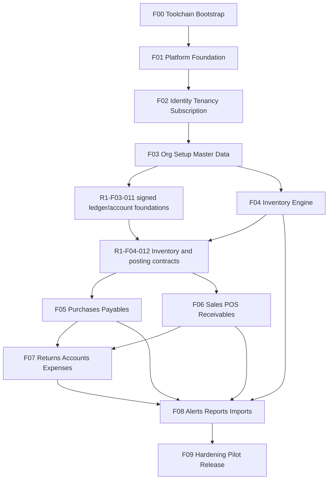

# Implementation Roadmap

Document status: Frozen for Release 1  
Current version: 1.2.0  
Last updated: 2026-08-08  
Approval status: Approved for implementation preparation

> **Amendment 1.1.0 (2026-08-05):** Frontend canonical project: `apps/frontend`. Backend canonical project: `apps/backend`. Backend implementation language was JavaScript ESM. Frontend implementation language: Angular TypeScript. Details: [tasks/F00-APP-NAMING-BACKEND-JS-MIGRATION.md](tasks/F00-APP-NAMING-BACKEND-JS-MIGRATION.md).
>
> **Amendment 1.2.0 (2026-08-08):** Backend implementation language: JavaScript CommonJS (`require` / `module.exports`). Frontend remains Angular TypeScript. Shared packages remain TypeScript. Details: [tasks/BACKEND-COMMONJS-MIGRATION.md](tasks/BACKEND-COMMONJS-MIGRATION.md).

## Document Authority

| Concern | Authoritative document |
| --- | --- |
| What Release 1 must provide | Frozen [PRD.md](PRD.md) |
| Release 1 boundary | Frozen [RELEASE_1_SCOPE.md](RELEASE_1_SCOPE.md) |
| Business behaviour | Frozen [BUSINESS_RULES.md](BUSINESS_RULES.md) |
| Domain terms | Frozen [DOMAIN_GLOSSARY.md](DOMAIN_GLOSSARY.md) |
| Finalized decisions | [PROJECT_DECISIONS.md](PROJECT_DECISIONS.md) |
| Architecture and modules | Frozen [ARCHITECTURE.md](ARCHITECTURE.md), [MODULE_BOUNDARIES.md](MODULE_BOUNDARIES.md), [REPOSITORY_STRUCTURE.md](REPOSITORY_STRUCTURE.md) |
| Data, API, security, subscription | Frozen P1-05 documents |
| Quality gates | Frozen [QUALITY_GATES.md](QUALITY_GATES.md) |
| Delivery estimates, risks, rollout | Frozen [DELIVERY_PLAN.md](DELIVERY_PLAN.md) |
| Implementation sequence and work items | This document |

This roadmap plans Release 1 implementation. It does not initialize the repository, select framework versions, or create application code. Implementation of F00 begins only after P1-07 toolchain specification.

---

## 1. Planning Principles

* Follow frozen module ownership and the modular monolith.
* Implement foundational capabilities before dependent workflows.
* Establish tenant isolation before tenant business modules.
* Establish authentication and authorization before protected operations.
* Establish transaction and idempotency infrastructure before financial workflows.
* Implement authoritative movements before dashboards and reports.
* Implement happy paths and failure paths together.
* Include tests in every work item; do not defer testing to an end-only phase.
* Avoid frontend-only feature completion without backend enforcement.
* Avoid building all backend modules before any usable vertical slice.
* Avoid client-specific forks.
* Keep Release 1 scope frozen.
* Use reversible, reviewable delivery increments.

---

## 2. Work-Item Format

Every work item uses stable `R1-F0x-*` IDs (not P1 task IDs) and includes owner, dependencies, frozen sources, backend/frontend/data/security scope, tests, Definition of Done, out of scope, risk, and effort (XS–XL).

---

## 3. Ten-Stage Sequence Overview

| Stage | Title | Work items | Entry gate | Exit gate |
| --- | --- | --- | --- | --- |
| F00 | Toolchain and Repository Bootstrap | 10 | P1-06 approved for continuation; P1-07 toolchain specification exists before execution of this stage’s implementation work. No business feature code yet. | Empty applications build and test; MongoDB transactions work locally; architecture checks can run; no business feature implementation yet. |
| F01 | Platform Foundation | 11 | F00 exit gate satisfied. | Infrastructure is testable; no module-owned tenant repository can omit organization scope; transaction retry and idempotency tests pass. |
| F02 | Identity, Tenancy, and Subscription Access | 14 | F01 exit gate satisfied. | Organization onboarding works end-to-end; cross-tenant tests pass; subscription suspension blocks operational writes; platform and organization contexts remain separated. |
| F03 | Organization Setup and Master Data | 13 | F02 exit gate satisfied. | A new approved organization can complete initial setup; opening financial entries reconcile; version conflicts are enforced; plan creation limits are enforced. |
| F04 | Inventory Engine | 12 | F03 exit gate satisfied. | Quantity and valuation reconciliation pass; concurrent stock posting cannot silently overwrite state; transfer failure cannot leave one-sided movement; batch identity remains preserved. |
| F05 | Purchases and Supplier Payables | 10 | F04 exit gate satisfied; R1-F03-011 and R1-F04-012 complete. | Purchase posts atomically; purchase failure rolls back all effects; supplier ledger and account movements reconcile; purchase returns enforce returnable and available quantity. |
| F06 | Sales, POS, and Customer Receivables | 11 | F04 exit gate satisfied; R1-F03-011 and R1-F04-012 complete. F06 does not require R1-F05-001 or R1-F05-002. | Sale posts atomically; duplicate retries cannot duplicate invoices; stock, COGS, receivable, payment, and account effects reconcile; critical cashier workflow passes E2E tests. |
| F07 | Returns, Corrections, Accounts, and Expenses | 9 | F05 and F06 exit gates satisfied for posted sources needed by returns/corrections. | Every reversal nets against its source; no generic arbitrary correction endpoint exists; return limits and batch availability are enforced; account balances reconcile to signed movements. |
| F08 | Alerts, Reporting, Imports, and Operational Views | 10 | F04–F07 authoritative operational modules exit gates satisfied for data depended on by alerts/reports/imports. | Reports reconcile to authoritative effects; imports are all-or-nothing; alerts do not own conflicting balances; suspended read/export policy is enforced. |
| F09 | Hardening, Pilot, and Release | 9 | F00–F08 exit gates satisfied for Release 1 scoped functionality. | All release gates pass; no unresolved critical or high-severity defect; restore rehearsal succeeds; pilot data reconciles; release approval is recorded. |

Stage requirement maps: **F00** → REPOSITORY_STRUCTURE.md; ARCHITECTURE.md tooling baseline; PROJECT_DECISIONS technical stack; **F01** → ARCHITECTURE.md infrastructure; DATA_MODEL.md technical fields, idempotency; API_DESIGN.md envelopes; MODULE_BOUNDARIES Audit/Operations/Platform; **F02** → SECURITY_AUTHORIZATION.md; SUBSCRIPTION_AND_BILLING.md; API_DESIGN identity/platform/subscription; MODULE_BOUNDARIES Identity, Organizations, Subscriptions, Platform; **F03** → Locations, Catalog, Customers, Suppliers, Accounts, Settings modules; FR-BRANCH/WAREHOUSE/PRODUCT/CUSTOMER/SUPPLIER/ACCOUNT; opening balance rules; **F04** → Inventory module; FR-INVENTORY/WAREHOUSE transfer; BR-INVENTORY/BATCH/COST/TRANSFER; DATA_MODEL inventory collections; **F05** → Purchases; Payments and Ledgers; Accounts; Inventory interfaces; FR-PURCHASE/PAYMENT; BR-PURCHASE/COST/PAYMENT/LEDGER; **F06** → Sales; Customers; Payments; Inventory; Accounts; FR-SALE/PAYMENT; BR-SALE/PAYMENT/COMMON; printing decisions; **F07** → Returns and Corrections; Accounts and Expenses; FR-RETURN/ACCOUNT/EXPENSE; BR-RETURN/CORRECTION/ACCOUNT/EXPENSE; **F08** → Alerts; Reporting; Imports; Audit views; Operations backup status; FR-ALERT/REPORT/IMPORT/AUDIT/SETTINGS; **F09** → QUALITY_GATES release gate; DELIVERY_PLAN pilot/rollout; NFR security/performance/backup.

---

## 4. Dependency Rules

* F00 precedes all implementation.
* F01 precedes tenant business modules.
* F02 precedes protected organization workflows.
* F03 precedes Inventory, Purchases, and Sales.
* F04 precedes posted Purchases and Sales.
* F05 and F06 may begin independently after signed ledger/account foundations (`R1-F03-011`) and shared Inventory/Audit posting contracts (`R1-F04-012`) are complete. Interleaving may reduce waiting and rework but does not reduce one-engineer effort. F06 must not require `R1-F05-001` or `R1-F05-002`.
* F07 depends on the relevant posted transaction sources from F05 and F06.
* F08 depends on authoritative operational data from F04–F07.
* F09 depends on all scoped functionality.



---

## 5. Vertical-Slice Rule

Each stage delivers usable vertical slices where practical:

```text
data
→ backend business workflow
→ authorization
→ API contract
→ frontend workflow
→ audit
→ tests
```

Do not mark a business feature complete when only its UI, route, schema, or controller exists.

---

## 6. Catalog Summary

| Stage | Count |
| --- | --- |
| F00 | 10 |
| F01 | 11 |
| F02 | 14 |
| F03 | 13 |
| F04 | 12 |
| F05 | 10 |
| F06 | 11 |
| F07 | 9 |
| F08 | 10 |
| F09 | 9 |
| **Total** | **109** |

Duplicate-ID validation at generation time: passed.  
Dependency acyclic validation at generation time: passed.

---

## 7. Work-Item Catalog by Stage

### Stage F00 — Toolchain and Repository Bootstrap

**Entry:** P1-06 approved for continuation; P1-07 toolchain specification exists before execution of this stage’s implementation work. No business feature code yet.  

**Exit:** Empty applications build and test; MongoDB transactions work locally; architecture checks can run; no business feature implementation yet.  

**Frozen maps:** REPOSITORY_STRUCTURE.md; ARCHITECTURE.md tooling baseline; PROJECT_DECISIONS technical stack

### R1-F00-001 — Monorepo workspace bootstrap

| Field | Value |
| --- | --- |
| ID | R1-F00-001 |
| Title | Monorepo workspace bootstrap |
| Owning module | Operations (tooling) / repository root |
| Dependencies | None |
| Frozen sources | REPOSITORY_STRUCTURE.md §1–2; PROJECT_DECISIONS technical stack; ARCHITECTURE.md modular monolith |
| Backend scope | Create target monorepo workspace layout for apps and packages without business modules. |
| Frontend scope | Reserve apps/frontend workspace package only; no feature modules. |
| Data scope | None beyond local tooling docs for DB connection placeholders. |
| Security scope | Ensure secrets are not committed; .gitignore for env files. |
| Tests | Smoke test that workspace install/bootstrap scripts succeed; architecture-boundary harness can load. |
| Definition of Done | Documented workspace matches frozen target layout; install and root scripts run without business code. |
| Out of scope | Framework version selection (P1-07); business schemas; CI provider selection finalization beyond foundation hooks. |
| Risk | Tooling choices later force rework of package boundaries. |
| Effort | M |

### R1-F00-002 — Angular frontend application scaffold

| Field | Value |
| --- | --- |
| ID | R1-F00-002 |
| Title | Angular frontend application scaffold |
| Owning module | Operations (tooling) / apps/frontend |
| Dependencies | R1-F00-001 |
| Frozen sources | REPOSITORY_STRUCTURE.md frontend layout; ARCHITECTURE.md browser client; PROJECT_DECISIONS Angular/TypeScript/SCSS |
| Backend scope | None. |
| Frontend scope | Executable empty Angular application with design-system SCSS entry. Create only directories required for the scaffold to build and test. Do not create empty feature folders or .gitkeep placeholders for every future feature; introduce a feature directory when its first real public interface, test, configuration, or implementation file is added. Frozen target layout remains the eventual structure. |
| Data scope | None. |
| Security scope | No auth UI yet; no secrets in client bundle. |
| Tests | Angular unit-test harness runs for a trivial component; type-check and lint pass. Architecture tests may use fixtures under test tooling rather than empty production folders. |
| Definition of Done | Empty web app builds, lints, type-checks, and runs unit-test harness without empty future-feature placeholder folders. |
| Out of scope | Feature modules; routing for business workflows; production hosting; empty .gitkeep trees mirroring every future feature. |
| Risk | Scaffold drifts from frozen feature-based layout when real features are added. |
| Effort | M |


### R1-F00-003 — Express JavaScript backend scaffold

| Field | Value |
| --- | --- |
| ID | R1-F00-003 |
| Title | Express JavaScript backend scaffold |
| Owning module | Operations (tooling) / apps/backend |
| Dependencies | R1-F00-001 |
| Frozen sources | REPOSITORY_STRUCTURE.md backend layout; ARCHITECTURE.md API container; API_DESIGN.md base prefix reserved |
| Backend scope | Executable empty Express/JavaScript (CommonJS) backend. Create only files and directories required for boot, health/scaffold routes later, and tooling. Do not create empty canonical-module folders or .gitkeep placeholders for every module; introduce a module directory when its first real public interface, test, configuration, or implementation file is added. Architecture tests may validate naming and boundaries using fixtures under test tooling. Frozen target layout remains the eventual structure. |
| Frontend scope | None. |
| Data scope | Connection stub only; no collections. |
| Security scope | No public business endpoints; health may be deferred to F01. |
| Tests | API boot smoke test; lint pass; architecture fixture proving forbidden imports without empty production module folders. (Historical `checkJs` gate superseded by plain-JS + ESLint convention — see [BACKEND-COMMONJS-MIGRATION.md](tasks/BACKEND-COMMONJS-MIGRATION.md) final amendment.) |
| Definition of Done | Empty backend builds, boots in test mode, and lints without empty future-module placeholder folders. |
| Out of scope | Business controllers/services; auth; transactions; empty .gitkeep trees for all canonical modules. |
| Risk | Controller-layer patterns that later violate thin-controller rule. |
| Effort | M |


### R1-F00-004 — Shared tooling and api-contracts packages

| Field | Value |
| --- | --- |
| ID | R1-F00-004 |
| Title | Shared tooling and api-contracts packages |
| Owning module | Operations (tooling) / packages |
| Dependencies | R1-F00-001 |
| Frozen sources | REPOSITORY_STRUCTURE.md packages/tooling-config, api-contracts, test-support rules |
| Backend scope | Wire shared TS/lint/format/test config consumption from apps. |
| Frontend scope | Consume shared tooling config from web app. |
| Data scope | None. |
| Security scope | api-contracts must not embed secrets or domain business rules. |
| Tests | Package build/type-check; assert api-contracts contains no Mongoose/Angular business logic. |
| Definition of Done | tooling-config, api-contracts, and test-support packages exist within frozen package rules. |
| Out of scope | Selecting exact lint/test tool versions beyond P1-07; business DTOs for all endpoints. |
| Risk | Shared packages becoming unowned dumping grounds. |
| Effort | S |

### R1-F00-005 — Build lint format test and type-check commands

| Field | Value |
| --- | --- |
| ID | R1-F00-005 |
| Title | Build lint format test and type-check commands |
| Owning module | Operations (tooling) |
| Dependencies | R1-F00-002, R1-F00-003, R1-F00-004 |
| Frozen sources | REPOSITORY_STRUCTURE.md scripts; QUALITY_GATES.md WI-G03/WI-G04; ARCHITECTURE.md testability goals |
| Backend scope | Root and package scripts for API build/lint/format/test/type-check. |
| Frontend scope | Root and package scripts for web build/lint/format/test/type-check. |
| Data scope | None. |
| Security scope | None beyond not printing secrets in scripts. |
| Tests | Commands succeed on empty apps; documented in README tooling section when initialized. |
| Definition of Done | Single documented entry commands run successfully for web and API. |
| Out of scope | CI provider; coverage thresholds finalization. |
| Risk | Inconsistent scripts across packages. |
| Effort | S |

### R1-F00-006 — Local MongoDB replica-set topology

| Field | Value |
| --- | --- |
| ID | R1-F00-006 |
| Title | Local MongoDB replica-set topology |
| Owning module | Operations |
| Dependencies | R1-F00-003 |
| Frozen sources | DATA_MODEL.md MongoDB baseline; ARCHITECTURE.md MongoDB; NFR transaction needs in PRD/RELEASE_1_SCOPE |
| Backend scope | Document and script local replica-set for transactions. |
| Frontend scope | None. |
| Data scope | Local replica-set topology only; no business collections. |
| Security scope | Local credentials via env only. |
| Tests | Integration smoke proving a multi-document transaction commits and aborts locally. |
| Definition of Done | Developer can start local replica-set and run a transaction smoke test. |
| Out of scope | Production hosting/backup provider selection. |
| Risk | Developers run standalone MongoDB and later discover transactions fail. |
| Effort | M |

### R1-F00-007 — Environment configuration validation foundation

| Field | Value |
| --- | --- |
| ID | R1-F00-007 |
| Title | Environment configuration validation foundation |
| Owning module | Platform / Operations |
| Dependencies | R1-F00-003, R1-F00-005 |
| Frozen sources | ARCHITECTURE.md configuration boundaries; SECURITY_AUTHORIZATION.md secrets handling; SUBSCRIPTION_AND_BILLING deployment notes |
| Backend scope | Fail-fast env schema validation stub for required runtime keys without selecting production values. |
| Frontend scope | Build-time public env validation for allowed client keys only. |
| Data scope | DB URI and related env keys validated. |
| Security scope | Reject missing required secrets in non-test profiles; never log secret values. |
| Tests | Unit tests for missing/invalid env; ensure secrets redacted. |
| Definition of Done | Apps refuse to boot with invalid required configuration in non-test mode. |
| Out of scope | Exact production env values; hosting provider. |
| Risk | Silent misconfiguration in later stages. |
| Effort | S |

### R1-F00-008 — Architecture-boundary testing foundation

| Field | Value |
| --- | --- |
| ID | R1-F00-008 |
| Title | Architecture-boundary testing foundation |
| Owning module | Operations (tooling) / Platform |
| Dependencies | R1-F00-002, R1-F00-003, R1-F00-004 |
| Frozen sources | MODULE_BOUNDARIES.md §5 forbidden dependencies; ARCHITECTURE.md modular monolith; REPOSITORY_STRUCTURE.md |
| Backend scope | Architecture tests detecting forbidden cross-module imports and controller persistence access patterns. |
| Frontend scope | Architecture tests detecting cross-feature internal imports. |
| Data scope | None. |
| Security scope | Guardrails that later enforce tenant repository patterns can plug into this harness. |
| Tests | Architecture-boundary tests themselves; fixture proving a forbidden import fails the check. |
| Definition of Done | Architecture checks runnable in local and CI foundation; forbidden-import fixture fails as expected. |
| Out of scope | Full module dependency matrix enforcement for unimplemented modules’ business code. |
| Risk | Weak rules that miss repository/model leakage. |
| Effort | M |

### R1-F00-009 — CI foundation

| Field | Value |
| --- | --- |
| ID | R1-F00-009 |
| Title | CI foundation |
| Owning module | Operations |
| Dependencies | R1-F00-005, R1-F00-006, R1-F00-008 |
| Frozen sources | QUALITY_GATES.md continuous gates; REPOSITORY_STRUCTURE.md; ARCHITECTURE.md observability/ops readiness |
| Backend scope | CI pipeline skeleton running install, lint, type-check, unit tests, architecture checks, and transaction smoke against replica-set service. |
| Frontend scope | Include web lint/type-check/unit tests in the same foundation pipeline. |
| Data scope | CI MongoDB replica-set service. |
| Security scope | No production secrets in CI logs; use CI secrets store placeholders. |
| Tests | Pipeline green on empty apps; transaction smoke job green. |
| Definition of Done | CI foundation runs required empty-app gates without business features. |
| Out of scope | Selecting final CI vendor details beyond foundation; deployment pipelines. |
| Risk | CI without replica-set false-green for transaction work. |
| Effort | M |

### R1-F00-010 — Test-support package foundation

| Field | Value |
| --- | --- |
| ID | R1-F00-010 |
| Title | Test-support package foundation |
| Owning module | Operations (tooling) / packages/test-support |
| Dependencies | R1-F00-004, R1-F00-006 |
| Frozen sources | REPOSITORY_STRUCTURE.md test-support rules; QUALITY_GATES.md test types; DATA_MODEL.md tenancy fields |
| Backend scope | Builders/fixtures placeholders for tenant context and transaction helpers without business logic. |
| Frontend scope | Shared testing utilities placeholders as allowed by package rules. |
| Data scope | Helpers for creating isolated org ids in tests later. |
| Security scope | Helpers must encourage organization scoping in tests. |
| Tests | Package unit tests; ensure no production business rules live in test-support. |
| Definition of Done | test-support package usable by later stages for tenant and transaction tests. |
| Out of scope | Full domain fixtures for all modules. |
| Risk | Test helpers encoding incorrect domain rules. |
| Effort | S |

### Stage F01 — Platform Foundation

**Entry:** F00 exit gate satisfied.  

**Exit:** Infrastructure is testable; no tenant repository can omit organization scope; transaction retry and idempotency tests pass.  

**Frozen maps:** ARCHITECTURE.md infrastructure; DATA_MODEL.md technical fields, idempotency; API_DESIGN.md envelopes; MODULE_BOUNDARIES Audit/Operations/Platform

### R1-F01-001 — Runtime configuration service

| Field | Value |
| --- | --- |
| ID | R1-F01-001 |
| Title | Runtime configuration service |
| Owning module | Platform |
| Dependencies | R1-F00-007 |
| Frozen sources | ARCHITECTURE.md configuration; SECURITY_AUTHORIZATION.md sensitive-data handling |
| Backend scope | Typed configuration module with environment profiles. |
| Frontend scope | Public configuration injection for API base URL only. |
| Data scope | None. |
| Security scope | Secret values accessible only server-side. |
| Tests | Unit tests for config parsing and redaction. |
| Definition of Done | Server config loads typed values; secrets never returned to clients. |
| Out of scope | Feature flags product surface; commercial plan values. |
| Risk | Leaking secrets through config dumps. |
| Effort | S |

### R1-F01-002 — Request ID middleware

| Field | Value |
| --- | --- |
| ID | R1-F01-002 |
| Title | Request ID middleware |
| Owning module | Platform / Operations |
| Dependencies | R1-F01-001 |
| Frozen sources | API_DESIGN.md envelopes/errors; ARCHITECTURE.md observability; NFR-OBS in PRD |
| Backend scope | Generate/propagate request IDs on all API responses/logs. |
| Frontend scope | Display/correlation support for error reporting where applicable. |
| Data scope | None. |
| Security scope | Do not accept client request IDs as security boundary. |
| Tests | API contract tests asserting request ID present on success and error. |
| Definition of Done | Every API response includes request correlation id. |
| Out of scope | External APM vendor selection. |
| Risk | Missing IDs on early error paths. |
| Effort | XS |

### R1-F01-003 — Structured logging foundation

| Field | Value |
| --- | --- |
| ID | R1-F01-003 |
| Title | Structured logging foundation |
| Owning module | Operations |
| Dependencies | R1-F01-001, R1-F01-002 |
| Frozen sources | ARCHITECTURE.md logging; SECURITY_AUTHORIZATION.md logging restrictions; FR-SETTINGS/NFR-OBS |
| Backend scope | Structured logs with request id, organization id when known, and redaction filters. |
| Frontend scope | Client error logging without PII/secrets. |
| Data scope | None. |
| Security scope | Never log passwords, tokens, CSRF secrets, or password hashes. |
| Tests | Unit tests proving secret fields redacted; security tests for forbidden log fields. |
| Definition of Done | Structured logger used by API bootstrap; redaction tests pass. |
| Out of scope | Monitoring provider integration. |
| Risk | Accidental token logging in auth stage. |
| Effort | S |

### R1-F01-004 — Central error handling and shared API envelopes

| Field | Value |
| --- | --- |
| ID | R1-F01-004 |
| Title | Central error handling and shared API envelopes |
| Owning module | Platform |
| Dependencies | R1-F01-002 |
| Frozen sources | API_DESIGN.md §3–4 envelopes and error codes; ARCHITECTURE.md API conventions |
| Backend scope | Central error mapper to frozen envelopes and error codes. |
| Frontend scope | Shared client parsing of success/list/error envelopes. |
| Data scope | None. |
| Security scope | Avoid leaking internal stack traces to clients in production. |
| Tests | API contract tests for success, list, and error envelopes. |
| Definition of Done | All scaffold endpoints and future modules can emit frozen envelopes. |
| Out of scope | Business error codes for unimplemented modules. |
| Risk | Inconsistent ad-hoc error shapes later. |
| Effort | S |

### R1-F01-005 — Database connection and health endpoint

| Field | Value |
| --- | --- |
| ID | R1-F01-005 |
| Title | Database connection and health endpoint |
| Owning module | Operations / Platform |
| Dependencies | R1-F01-001, R1-F00-006 |
| Frozen sources | DATA_MODEL.md baseline; API_DESIGN health if present; MODULE_BOUNDARIES Operations; FR-SETTINGS health |
| Backend scope | Mongo connection lifecycle; health endpoint reporting readiness without leaking internals. |
| Frontend scope | Optional ops status view deferred; basic connectivity only if needed for dev. |
| Data scope | Connection to replica-set; no business collections required. |
| Security scope | Health endpoint does not expose secrets or tenant data. |
| Tests | Integration tests for connect/disconnect; health returns degraded when DB down. |
| Definition of Done | API connects to replica-set; health reflects DB readiness. |
| Out of scope | Full backup/restore UI. |
| Risk | Health used as unauthenticated data oracle. |
| Effort | S |

### R1-F01-006 — Transaction abstraction and retry

| Field | Value |
| --- | --- |
| ID | R1-F01-006 |
| Title | Transaction abstraction and retry |
| Owning module | Platform |
| Dependencies | R1-F01-005 |
| Frozen sources | DATA_MODEL.md transactions; ARCHITECTURE.md atomic workflows; BUSINESS_RULES BR-COMMON posting atomicity; AGENTS.md transaction rule |
| Backend scope | Shared transaction runner with abort/rollback and retry policy for transient errors. |
| Frontend scope | None. |
| Data scope | Uses Mongo sessions/transactions. |
| Security scope | Transactions cannot cross organizations’ data by omitting scope. |
| Tests | Transaction rollback tests; retry unit/integration tests. |
| Definition of Done | Callable transaction abstraction with proven commit and full rollback. |
| Out of scope | Distributed transactions; saga frameworks. |
| Risk | Partial writes outside the abstraction. |
| Effort | M |

### R1-F01-007 — Infrastructure-owned idempotency

| Field | Value |
| --- | --- |
| ID | R1-F01-007 |
| Title | Infrastructure-owned idempotency |
| Owning module | API Infrastructure — Transactions and Idempotency (technical infrastructure owner, not a new canonical business module) |
| Dependencies | R1-F01-006 |
| Frozen sources | API_DESIGN.md §8 idempotency; DATA_MODEL.md idempotency_records; BUSINESS_RULES duplicate-effect prevention |
| Backend scope | Idempotency key storage and replay of prior responses for mutating endpoints, exposed as injected infrastructure interfaces. Business modules consume idempotency through those interfaces and must not depend on Platform or Identity and Access merely to obtain idempotency. |
| Frontend scope | Client support for sending idempotency keys on critical posts. |
| Data scope | `idempotency_records` per DATA_MODEL.md. |
| Security scope | Keys scoped to actor/organization context; no cross-tenant replay. |
| Tests | Idempotency tests for duplicate retry; tenant-isolation tests on key scope; architecture tests proving business modules use injected infrastructure interfaces. |
| Definition of Done | Duplicate requests with same key do not double-apply side effects in reference handlers; ownership is API Infrastructure — Transactions and Idempotency. |
| Out of scope | Enabling every future endpoint before those modules exist; treating idempotency as a Platform business module. |
| Risk | Keys not bound to tenant/actor; modules coupling to Platform only for idempotency. |
| Effort | M |


### R1-F01-008 — Decimal and date primitives

| Field | Value |
| --- | --- |
| ID | R1-F01-008 |
| Title | Decimal and date primitives |
| Owning module | Platform |
| Dependencies | R1-F00-004 |
| Frozen sources | DATA_MODEL.md §2 decimal/date; BUSINESS_RULES BR-COMMON money/quantity/rounding; API_DESIGN.md serialization |
| Backend scope | Shared decimal/date primitives matching frozen money/quantity rules. |
| Frontend scope | Display/parsing helpers aligned to API serialization. |
| Data scope | Storage representation helpers for money/quantity fields. |
| Security scope | None specific. |
| Tests | Pure business-rule unit tests for rounding, precision, and date-only behaviour. |
| Definition of Done | Primitives enforce BR-COMMON money/quantity rules without float drift. |
| Out of scope | Tax calculations; multi-currency. |
| Risk | Binary floating point leaking into totals. |
| Effort | M |

### R1-F01-009 — Tenant-safe repository foundation

| Field | Value |
| --- | --- |
| ID | R1-F01-009 |
| Title | Tenant-safe repository foundation |
| Owning module | Platform |
| Dependencies | R1-F01-005, R1-F01-006 |
| Frozen sources | DATA_MODEL.md organizationId; MODULE_BOUNDARIES tenancy and module-owned repositories; BUSINESS_RULES BR-ORG-001/002; SECURITY_AUTHORIZATION tenant enforcement; FR-PLATFORM-004 |
| Backend scope | Provide mandatory tenant-scope context, organization-scope query guards, shared organization-filter composition, scope-validation helpers, architecture-test rules, and narrow persistence infrastructure primitives. Do not create one global repository, a generic CRUD repository used by all modules, a base class with access to every collection, cross-module persistence access, or business-domain query methods. Each module still owns its repositories and Mongoose models. |
| Frontend scope | None. |
| Data scope | No new collections. Patterns/indexes guidance for organizationId on tenant-owned canonical collections only. |
| Security scope | Architecture/tenant-scope tests fail if organization scope is omitted from module-owned tenant repositories. |
| Tests | Architecture-boundary tests; tenant-isolation unit/integration tests on a sample module-owned repository using the shared scope helpers. |
| Definition of Done | Module-owned tenant repositories cannot omit organization scope; no global or cross-module generic repository exists. |
| Out of scope | All module repositories and models (created in later owning modules); any global CRUD base spanning collections. |
| Risk | Ad-hoc Mongoose usage bypassing mandatory tenant-scope infrastructure and module-owned repositories. |
| Effort | L |


### R1-F01-010 — Audit foundation write path

| Field | Value |
| --- | --- |
| ID | R1-F01-010 |
| Title | Audit foundation write path |
| Owning module | Audit |
| Dependencies | R1-F01-006, R1-F01-009 |
| Frozen sources | MODULE_BOUNDARIES Audit; DATA_MODEL.md audit_events; SECURITY_AUTHORIZATION audit requirements; FR-AUDIT-*; BR-AUDIT |
| Backend scope | Audit public interface to append required business audit events in the same MongoDB transaction as the authoritative business effects they audit. After-commit behaviour may be used only for non-authoritative technical notifications, external monitoring, or rebuildable operational projections. An after-commit action must not be the only record of a required business audit event. |
| Frontend scope | None beyond later views. |
| Data scope | `audit_events` collection and indexes. |
| Security scope | Audit writes capture actor/org; cannot be used to read other tenants. |
| Tests | Integration tests proving required business audit events commit or roll back with the same transaction as business effects; tenant-scope tests; unit tests for required fields; tests that after-commit-only paths are not treated as required business audit. |
| Definition of Done | Modules record required business audit events only through the public Audit interface and inside the authoritative business transaction. |
| Out of scope | Full audit UI; retention commercial entitlements UI; treating monitoring events as business audit. |
| Risk | Business modules writing ad-hoc audit collections or relying on after-commit-only audit for required events. |
| Effort | M |


### R1-F01-011 — Shared validation and optimistic concurrency helpers

| Field | Value |
| --- | --- |
| ID | R1-F01-011 |
| Title | Shared validation and optimistic concurrency helpers |
| Owning module | Platform |
| Dependencies | R1-F01-004, R1-F01-008 |
| Frozen sources | API_DESIGN.md optimistic concurrency; DATA_MODEL.md version fields; SECURITY_AUTHORIZATION input validation |
| Backend scope | Shared request validation hooks and version conflict helpers. |
| Frontend scope | Form error mapping for validation and version conflicts. |
| Data scope | version/updatedAt conventions on master-data docs. |
| Security scope | Server-side validation is authoritative. |
| Tests | Unit/API tests for version conflict responses. |
| Definition of Done | Standard 409/version conflict behaviour available for master-data modules. |
| Out of scope | Per-entity validators for all masters. |
| Risk | Clients treating UI validation as sufficient. |
| Effort | S |

### Stage F02 — Identity, Tenancy, and Subscription Access

**Entry:** F01 exit gate satisfied.  

**Exit:** Organization onboarding works end-to-end; cross-tenant tests pass; subscription suspension blocks operational writes; platform and organization contexts remain separated.  

**Frozen maps:** SECURITY_AUTHORIZATION.md; SUBSCRIPTION_AND_BILLING.md; API_DESIGN identity/platform/subscription; MODULE_BOUNDARIES Identity, Organizations, Subscriptions, Platform

### R1-F02-001 — Global users and credentials

| Field | Value |
| --- | --- |
| ID | R1-F02-001 |
| Title | Global users and credentials |
| Owning module | Identity and Access |
| Dependencies | R1-F01-009, R1-F01-010 |
| Frozen sources | DATA_MODEL.md users; SECURITY_AUTHORIZATION password policy; FR-AUTH-001; BR-ORG |
| Backend scope | User identity persistence, password hashing, credential verification. |
| Frontend scope | None yet beyond later login. |
| Data scope | `users` collection and indexes. |
| Security scope | Password hashing; no plaintext storage; logging restrictions. |
| Tests | Unit tests for password policy; security tests; repository integration tests. |
| Definition of Done | Users can be persisted and authenticated against hashed credentials. |
| Out of scope | Social login; MFA products not in Release 1 scope. |
| Risk | Weak hashing or password logging. |
| Effort | M |

### R1-F02-002 — Memberships and default role bundles

| Field | Value |
| --- | --- |
| ID | R1-F02-002 |
| Title | Memberships and default role bundles |
| Owning module | Identity and Access |
| Dependencies | R1-F02-001 |
| Frozen sources | SECURITY_AUTHORIZATION permission catalog and role bundles; FR-USER-*; DATA_MODEL memberships; BR-ORG-003 |
| Backend scope | Membership model linking users to organization or platform context with role bundles and conditional grants. |
| Frontend scope | None yet. |
| Data scope | `organization_memberships` and related permission-resolution fields per DATA_MODEL.md. |
| Security scope | Owner-presence invariant hooks prepared; platform vs org membership separation. |
| Tests | Permission unit tests for default bundles; integration tests for membership constraints. |
| Definition of Done | Memberships resolve effective permissions per frozen role bundles. |
| Out of scope | Custom role editor product beyond frozen bundles. |
| Risk | Over-granting via incorrect bundle mapping. |
| Effort | L |

### R1-F02-003 — Opaque sessions and CSRF

| Field | Value |
| --- | --- |
| ID | R1-F02-003 |
| Title | Opaque sessions and CSRF |
| Owning module | Identity and Access |
| Dependencies | R1-F02-001, R1-F01-004 |
| Frozen sources | SECURITY_AUTHORIZATION sessions/CSRF/CORS; API_DESIGN auth transport; FR-AUTH-009/010 |
| Backend scope | Opaque server-side sessions; CSRF token issuance/rotation; logout/invalidation. |
| Frontend scope | Login/logout session handling and CSRF header attachment. |
| Data scope | `auth_sessions` collection. |
| Security scope | Cookie flags; CSRF on mutating requests; session expiration/invalidation. |
| Tests | Security tests for CSRF; session expiry/invalidation tests; API contract tests. |
| Definition of Done | Authenticated session lifecycle works with CSRF protection. |
| Out of scope | JWT access-token alternative designs. |
| Risk | CSRF gaps on some mutating routes. |
| Effort | L |

### R1-F02-004 — Password reset

| Field | Value |
| --- | --- |
| ID | R1-F02-004 |
| Title | Password reset |
| Owning module | Identity and Access |
| Dependencies | R1-F02-001, R1-F02-003 |
| Frozen sources | SECURITY_AUTHORIZATION password reset; API_DESIGN password-reset endpoints; FR-AUTH-003 |
| Backend scope | Reset request/confirm with hashed tokens, expiry, and rate limits. |
| Frontend scope | Password reset request/confirm screens. |
| Data scope | `password_reset_tokens` per DATA_MODEL.md. |
| Security scope | Rate limiting; single-use tokens; no token leakage in logs/responses. |
| Tests | Security tests; API tests; Angular form tests. |
| Definition of Done | Eligible users can reset passwords; tokens expire and cannot be reused. |
| Out of scope | Automated email delivery provider workflows (manual/out-of-band delivery acceptable per frozen exclusions). |
| Risk | Reset token enumeration or reuse. |
| Effort | M |

### R1-F02-005 — Organization activation requests

| Field | Value |
| --- | --- |
| ID | R1-F02-005 |
| Title | Organization activation requests |
| Owning module | Platform |
| Dependencies | R1-F02-001, R1-F01-010 |
| Frozen sources | API_DESIGN organization-activation-requests; FR-AUTH-004; FR-ORG-002; SUBSCRIPTION_AND_BILLING onboarding; DATA_MODEL.md organizations/users/organization_memberships/subscriptions/account_activation_tokens/audit_events |
| Backend scope | Public activation request intake coordinating Organizations, Identity and Access, Subscriptions, and Audit public interfaces. Pending onboarding persists only approved canonical records: `organizations`, `users`, `organization_memberships`, `subscriptions`, `account_activation_tokens`, and `audit_events`. Do not invent an `organization_activation_requests` collection. |
| Frontend scope | Public activation request form on landing flow. |
| Data scope | `organizations`, `users`, `organization_memberships`, `subscriptions`, `account_activation_tokens`, and `audit_events` only. No unapproved activation-request collection. |
| Security scope | Public rate limits; no tenant data leakage; idempotency on create via `idempotency_records`. |
| Tests | API contract; idempotency; audit assertions in the same transaction as authoritative onboarding effects; Angular form tests; assert no invented activation-request collection. |
| Definition of Done | Public request creates pending onboarding state using only frozen canonical collections without granting operational access. |
| Out of scope | Auto-approval; messaging automation; inventing `organization_activation_requests`. |
| Risk | Request creates usable org access prematurely or invents non-canonical persistence. |
| Effort | M |


### R1-F02-006 — Platform organization create approve and Owner activation

| Field | Value |
| --- | --- |
| ID | R1-F02-006 |
| Title | Platform organization create approve and Owner activation |
| Owning module | Platform / Identity and Access / Organizations |
| Dependencies | R1-F02-002, R1-F02-005, R1-F02-003 |
| Frozen sources | FR-ORG-001/002/003; API_DESIGN platform organizations; BR-ORG-003; SECURITY_AUTHORIZATION platform permissions |
| Backend scope | Super Admin create/approve; initial Owner activation token consumption; Owner-presence enforcement. |
| Frontend scope | Platform org list/create/approve UI; Owner activation set-password UI. |
| Data scope | `organizations`; `account_activation_tokens`; `organization_memberships`; related `users` and `subscriptions` updates; `audit_events`. |
| Security scope | platform.* permissions; platform context only; audit of approvals. |
| Tests | Permission tests; E2E onboarding; tenant-isolation; audit assertions; idempotency. |
| Definition of Done | Approved organization has active Owner; unapproved cannot operate. |
| Out of scope | Dedicated-cloud provisioning automation beyond configuration hooks. |
| Risk | Org usable without Owner. |
| Effort | L |

### R1-F02-007 — Active session context selection

| Field | Value |
| --- | --- |
| ID | R1-F02-007 |
| Title | Active session context selection |
| Owning module | Identity and Access |
| Dependencies | R1-F02-003, R1-F02-002 |
| Frozen sources | API_DESIGN auth/session and context; SECURITY_AUTHORIZATION active context; FR-AUTH-005 |
| Backend scope | Session context switch between platform and authorized memberships with session/CSRF rotation. |
| Frontend scope | Context switcher UI. |
| Data scope | Active context fields on `auth_sessions`. |
| Security scope | Cannot select unauthorized membership; rotation on switch. |
| Tests | Security/API tests for unauthorized context; Angular tests. |
| Definition of Done | Users only operate in explicitly selected authorized context. |
| Out of scope | Multi-org simultaneous concurrent editing UX. |
| Risk | Stale permissions after context switch. |
| Effort | M |

### R1-F02-008 — Permission evaluation middleware

| Field | Value |
| --- | --- |
| ID | R1-F02-008 |
| Title | Permission evaluation middleware |
| Owning module | Identity and Access |
| Dependencies | R1-F02-007, R1-F02-002 |
| Frozen sources | SECURITY_AUTHORIZATION §6–9; FR-AUTH-005/007/008; API_DESIGN endpoint permission mapping |
| Backend scope | Middleware/services resolving permission codes; deny-by-default for protected routes. |
| Frontend scope | Permission-aware UI hiding only (non-authoritative). |
| Data scope | Uses membership permission resolution. |
| Security scope | Backend enforcement; no role-name checks except documented platform boundaries. |
| Tests | Permission tests matrix samples; architecture tests forbidding UI-only auth assumptions in API. |
| Definition of Done | Protected route sample enforces permission codes end-to-end. |
| Out of scope | Wiring every future endpoint before those modules exist. |
| Risk | Role-name checks creeping into services. |
| Effort | M |

### R1-F02-009 — Branch and warehouse assignment enforcement foundation

| Field | Value |
| --- | --- |
| ID | R1-F02-009 |
| Title | Branch and warehouse assignment enforcement foundation |
| Owning module | Identity and Access / Locations |
| Dependencies | R1-F02-008 |
| Frozen sources | FR-AUTH-006; FR-USER-003; SECURITY_AUTHORIZATION tenant/branch/warehouse; BR-ORG-005; DATA_MODEL assignments |
| Backend scope | Enforcement helpers denying operations outside assigned branches/warehouses. |
| Frontend scope | Assignment-aware selectors later consume the same rules. |
| Data scope | `access_assignments` fields ready for Locations stage population; no invented assignment collection. |
| Security scope | Backend enforcement foundation with tests using fixture assignments. |
| Tests | Permission/tenant-scope tests with assignment fixtures. |
| Definition of Done | Enforcement helper blocks out-of-assignment operations in tests. |
| Out of scope | Full Locations CRUD UI (F03). |
| Risk | Checks applied inconsistently per module. |
| Effort | M |

### R1-F02-010 — Plans and subscription records

| Field | Value |
| --- | --- |
| ID | R1-F02-010 |
| Title | Plans and subscription records |
| Owning module | Subscriptions |
| Dependencies | R1-F01-010, R1-F01-009 |
| Frozen sources | SUBSCRIPTION_AND_BILLING.md plans; DATA_MODEL subscription collections; FR-SUB-001/014/015; BR-SUB |
| Backend scope | Plan versioning and per-organization subscription record APIs for platform management. |
| Frontend scope | Platform plan/subscription admin views (prices as configurable data). |
| Data scope | `subscription_plans`; `subscriptions`. |
| Security scope | Platform permissions for plan management; org cannot mutate plan definitions. |
| Tests | Integration tests for plan immutability after reference; permission tests. |
| Definition of Done | Organizations reference immutable plan versions; commercial numbers remain data-driven. |
| Out of scope | Exact commercial price decisions. |
| Risk | Hardcoded prices/limits in code. |
| Effort | M |

### R1-F02-011 — Trial grace suspension and entitlement enforcement

| Field | Value |
| --- | --- |
| ID | R1-F02-011 |
| Title | Trial grace suspension and entitlement enforcement |
| Owning module | Subscriptions |
| Dependencies | R1-F02-010, R1-F02-008 |
| Frozen sources | SUBSCRIPTION_AND_BILLING lifecycle; SECURITY_AUTHORIZATION entitlement enforcement; FR-SUB-004/005/007/008/009/010; BR-SUB |
| Backend scope | State transitions; entitlement evaluation; middleware blocking operational writes when suspended. |
| Frontend scope | Subscription status banners and soft-warning UX. |
| Data scope | Subscription state and entitlement fields on `subscriptions` / referenced `subscription_plans`. |
| Security scope | Backend blocks; frontend warnings non-authoritative. |
| Tests | Subscription tests for trial/grace/suspend/reactivate; API denial tests. |
| Definition of Done | Suspended organizations cannot perform operational writes; soft warnings precede hard limits. |
| Out of scope | Payment gateway automation. |
| Risk | Write paths bypassing entitlement middleware. |
| Effort | L |

### R1-F02-012 — Manual billing evidence and Super Admin review

| Field | Value |
| --- | --- |
| ID | R1-F02-012 |
| Title | Manual billing evidence and Super Admin review |
| Owning module | Subscriptions / Platform |
| Dependencies | R1-F02-011 |
| Frozen sources | SUBSCRIPTION_AND_BILLING manual billing; FR-SUB-006; API_DESIGN billing endpoints; BR-SUB |
| Backend scope | Billing evidence submission and platform review/status transitions. |
| Frontend scope | Org billing evidence upload UX; platform review queue. |
| Data scope | `subscription_billing_records`. |
| Security scope | Permissions for submit vs review; audit; file validation limits placeholders without final numeric limits. |
| Tests | API/permission/audit tests; Angular form tests. |
| Definition of Done | Manual bank/JazzCash/Easypaisa evidence can be submitted and reviewed without gateway integration. |
| Out of scope | Automated settlement; WhatsApp/SMS/email automation. |
| Risk | Review marking subscription active without audit. |
| Effort | M |

### R1-F02-013 — Public landing sign-in and onboarding Angular workflows

| Field | Value |
| --- | --- |
| ID | R1-F02-013 |
| Title | Public landing sign-in and onboarding Angular workflows |
| Owning module | Identity and Access / Platform |
| Dependencies | R1-F02-003, R1-F02-006, R1-F02-007 |
| Frozen sources | FR-PLATFORM-005; FR-AUTH-001/002; RELEASE_1_SCOPE public and authentication |
| Backend scope | Login/logout/session endpoints wired end-to-end. |
| Frontend scope | Landing, sign-in, sign-out, activation, and session shell. |
| Data scope | Uses `users`, `auth_sessions`, `organization_memberships`, and related identity collections. |
| Security scope | CSRF/session; no UI-only auth. |
| Tests | Angular component tests; critical E2E onboarding/sign-in; security tests. |
| Definition of Done | E2E path from landing through approved Owner sign-in works. |
| Out of scope | Marketing CMS; Urdu UI. |
| Risk | Shell shipping without backend permission checks. |
| Effort | M |

### R1-F02-014 — Cross-tenant isolation and platform context test suite

| Field | Value |
| --- | --- |
| ID | R1-F02-014 |
| Title | Cross-tenant isolation and platform context test suite |
| Owning module | Identity and Access / Platform |
| Dependencies | R1-F02-006, R1-F02-008, R1-F02-011 |
| Frozen sources | FR-PLATFORM-004; NFR-SEC; BR-ORG-001/002; SECURITY_AUTHORIZATION tenant enforcement |
| Backend scope | Expand isolation harness for org data and platform-only routes. |
| Frontend scope | None. |
| Data scope | Multi-organization test fixtures only; no new persistent collections. |
| Security scope | Attack-style cross-tenant read/write attempts. |
| Tests | Tenant-isolation tests; security tests; subscription suspension write-block tests. |
| Definition of Done | Cross-tenant suite green; platform/org separation proven; suspension blocks writes. |
| Out of scope | Full module coverage for not-yet-built collections. |
| Risk | False confidence from too-narrow fixtures. |
| Effort | M |

### Stage F03 — Organization Setup and Master Data

**Entry:** F02 exit gate satisfied.  

**Exit:** A new approved organization can complete initial setup; opening financial entries reconcile; version conflicts are enforced; plan creation limits are enforced.  

**Frozen maps:** Locations, Catalog, Customers, Suppliers, Accounts, Settings modules; FR-BRANCH/WAREHOUSE/PRODUCT/CUSTOMER/SUPPLIER/ACCOUNT; opening balance rules

### R1-F03-001 — Organization settings

| Field | Value |
| --- | --- |
| ID | R1-F03-001 |
| Title | Organization settings |
| Owning module | Settings / Organizations |
| Dependencies | R1-F02-008, R1-F02-011 |
| Frozen sources | FR-ORG-005; FR-SETTINGS-001; MODULE_BOUNDARIES Settings; DATA_MODEL organization settings |
| Backend scope | Organization settings read/update with version concurrency. |
| Frontend scope | Settings screens for Release 1 operational settings. |
| Data scope | `organization_settings` per DATA_MODEL.md. |
| Security scope | settings permissions; subscription write policy; audit sensitive changes. |
| Tests | Permission; subscription; optimistic concurrency; Angular form tests. |
| Definition of Done | Authorized users manage Release 1 org settings with version conflicts enforced. |
| Out of scope | Settings owned by specialized modules (credit policy, expiry thresholds, subscription). |
| Risk | Duplicating domain-owned settings. |
| Effort | S |

### R1-F03-002 — Branches

| Field | Value |
| --- | --- |
| ID | R1-F03-002 |
| Title | Branches |
| Owning module | Locations |
| Dependencies | R1-F03-001, R1-F02-011 |
| Frozen sources | FR-BRANCH-001/002; DATA_MODEL branches; BR-ORG; SUBSCRIPTION plan limits |
| Backend scope | Branch CRUD; invoice prefix configuration fields. |
| Frontend scope | Branch management UI. |
| Data scope | `branches` collection and indexes. |
| Security scope | locations permissions; plan branch limits; tenant scope. |
| Tests | Integration; permission; subscription limit; version conflict tests. |
| Definition of Done | Org can create/manage branches within entitlements. |
| Out of scope | Invoice sequence posting (Sales F06). |
| Risk | Exceeding plan limits without soft warning. |
| Effort | M |

### R1-F03-003 — Warehouses

| Field | Value |
| --- | --- |
| ID | R1-F03-003 |
| Title | Warehouses |
| Owning module | Locations |
| Dependencies | R1-F03-002 |
| Frozen sources | FR-WAREHOUSE-001/002; DATA_MODEL warehouses; plan limits |
| Backend scope | Warehouse CRUD supporting one-to-many warehouses. |
| Frontend scope | Warehouse management UI. |
| Data scope | `warehouses` collection and indexes. |
| Security scope | permissions; plan warehouse limits; tenant scope. |
| Tests | Integration; permission; subscription limit tests. |
| Definition of Done | Org can start with one warehouse and add more within limits. |
| Out of scope | Stock transfers (F04). |
| Risk | Warehouse created without org scope. |
| Effort | S |

### R1-F03-004 — Employees and access assignments

| Field | Value |
| --- | --- |
| ID | R1-F03-004 |
| Title | Employees and access assignments |
| Owning module | Identity and Access / Locations |
| Dependencies | R1-F03-002, R1-F03-003, R1-F02-009 |
| Frozen sources | FR-USER-002/003; SECURITY_AUTHORIZATION; DATA_MODEL memberships/assignments; BR-ORG-003/005 |
| Backend scope | Owner manages employees; branch/warehouse assignments; Owner-presence on membership changes. |
| Frontend scope | Employee and assignment management UI. |
| Data scope | `organization_memberships` updates; `access_assignments`. |
| Security scope | users/access permissions; cannot manage other orgs; plan active-user limits. |
| Tests | Permission; tenant-isolation; Owner-presence transaction tests; subscription limits; Angular tests. |
| Definition of Done | Employees assigned to branches/warehouses; Owner invariant held transactionally. |
| Out of scope | Cross-organization employee sharing. |
| Risk | Removing last Owner. |
| Effort | L |

### R1-F03-005 — Categories and products

| Field | Value |
| --- | --- |
| ID | R1-F03-005 |
| Title | Categories and products |
| Owning module | Catalog and Pricing |
| Dependencies | R1-F03-001, R1-F02-011 |
| Frozen sources | FR-PRODUCT-001/002/008/009; BR-BATCH; DATA_MODEL catalog collections |
| Backend scope | Category and product master APIs including tracking mode fields. |
| Frontend scope | Category/product management UI. |
| Data scope | `product_categories`; `products` indexes. |
| Security scope | catalog permissions; product plan limits; tenant scope; audit where required. |
| Tests | Integration; permission; subscription; validation for mandatory batch categories. |
| Definition of Done | Products configurable with tracking modes; fertilizers/seeds/pesticides/chemicals require batch tracking. |
| Out of scope | Stock balances; posted snapshots. |
| Risk | Allowing non-batch mode for mandatory product classes. |
| Effort | M |

### R1-F03-006 — Base units and packaging conversions

| Field | Value |
| --- | --- |
| ID | R1-F03-006 |
| Title | Base units and packaging conversions |
| Owning module | Catalog and Pricing |
| Dependencies | R1-F03-005, R1-F01-008 |
| Frozen sources | FR-PRODUCT-003/004/005/006/007; BR-UNIT; DATA_MODEL units/conversions |
| Backend scope | Base units and packaging conversion configuration with precision rules. |
| Frontend scope | Unit/conversion editors on products. |
| Data scope | Base-unit fields on `products`; packaging and conversion factors on `product_packaging_units`. Do not invent a generic units collection outside the frozen Data Model. |
| Security scope | catalog permissions; server validation of factors. |
| Tests | Pure BR-UNIT unit tests; integration; Angular form tests. |
| Definition of Done | Packaging units convert to base units with frozen precision rules. |
| Out of scope | Historical snapshot posting (transaction modules). |
| Risk | Float conversion drift. |
| Effort | M |

### R1-F03-007 — Price tiers and product prices

| Field | Value |
| --- | --- |
| ID | R1-F03-007 |
| Title | Price tiers and product prices |
| Owning module | Catalog and Pricing |
| Dependencies | R1-F03-005 |
| Frozen sources | FR-PRODUCT-010/011/012 and pricing FRs; PROJECT_DECISIONS price tiers; DATA_MODEL prices |
| Backend scope | Price tier and product price maintenance APIs. |
| Frontend scope | Pricing maintenance UI. |
| Data scope | `product_prices` collection and indexes. |
| Security scope | catalog/pricing permissions; audit for sensitive price changes where required. |
| Tests | Integration; permission; concurrency tests. |
| Definition of Done | Retail/Wholesale/Dealer/Distributor prices maintainable per product. |
| Out of scope | POS price override (F06). |
| Risk | Price edits rewriting historical posted snapshots later. |
| Effort | M |

### R1-F03-008 — Customers and credit policy

| Field | Value |
| --- | --- |
| ID | R1-F03-008 |
| Title | Customers and credit policy |
| Owning module | Customers |
| Dependencies | R1-F03-007, R1-F02-011 |
| Frozen sources | FR-CUSTOMER-001–004; FR-PRODUCT-010/011; BR-SALE credit rules; DATA_MODEL customers |
| Backend scope | Customer CRUD; customer type; credit-limit behaviour configuration. |
| Frontend scope | Customer management UI including credit policy fields. |
| Data scope | `customers` collection including credit-policy fields. |
| Security scope | customers permissions; plan customer limits; tenant scope. |
| Tests | Integration; permission; subscription; validation of walk-in credit policy constraints. |
| Definition of Done | Customers maintainable with separate type and price tier; credit policy configurable. |
| Out of scope | Posting receivables (Payments/Sales). |
| Risk | Anonymous walk-in credit allowed contrary to rules. |
| Effort | M |

### R1-F03-009 — Suppliers

| Field | Value |
| --- | --- |
| ID | R1-F03-009 |
| Title | Suppliers |
| Owning module | Suppliers |
| Dependencies | R1-F03-001, R1-F02-011 |
| Frozen sources | FR-SUPPLIER-001; DATA_MODEL suppliers; plan limits |
| Backend scope | Supplier CRUD APIs. |
| Frontend scope | Supplier management UI. |
| Data scope | `suppliers` collection and indexes. |
| Security scope | suppliers permissions; plan supplier limits; tenant scope. |
| Tests | Integration; permission; subscription tests. |
| Definition of Done | Suppliers maintainable within entitlements. |
| Out of scope | Purchase posting; supplier payments. |
| Risk | Supplier usable across tenants. |
| Effort | S |

### R1-F03-010 — Accounts master data

| Field | Value |
| --- | --- |
| ID | R1-F03-010 |
| Title | Accounts master data |
| Owning module | Accounts and Expenses |
| Dependencies | R1-F03-001 |
| Frozen sources | FR-ACCOUNT-*; DATA_MODEL accounts; BR-ACCOUNT; PROJECT_DECISIONS cash/bank/JazzCash/Easypaisa |
| Backend scope | Cash/bank/JazzCash/Easypaisa account master APIs. |
| Frontend scope | Accounts management UI. |
| Data scope | `accounts` collection. |
| Security scope | accounts permissions; tenant scope. |
| Tests | Integration; permission tests. |
| Definition of Done | Organization can configure required payment accounts. |
| Out of scope | Account movements posting beyond openings (F07 expands). |
| Risk | Balance fields edited directly instead of movements. |
| Effort | M |

### R1-F03-011 — Signed ledger/account foundations and opening balances

| Field | Value |
| --- | --- |
| ID | R1-F03-011 |
| Title | Signed ledger/account foundations and opening balances |
| Owning module | Payments and Ledgers / Accounts and Expenses / Customers / Suppliers |
| Dependencies | R1-F03-008, R1-F03-009, R1-F03-010, R1-F01-006, R1-F01-007, R1-F01-010 |
| Frozen sources | RELEASE_1_SCOPE opening balances; DATA_MODEL.md customers/suppliers opening source facts, ledger_effects, account_movements, accounts; SECURITY_AUTHORIZATION customers.opening-balance.post, suppliers.opening-balance.post, accounts.opening-balance.post; BR-LEDGER; BR-ACCOUNT; MODULE_BOUNDARIES Payments and Ledgers / Accounts and Expenses public interfaces |
| Backend scope | Establish public Payments and Ledgers interface for signed receivable/payable effects and public Accounts and Expenses interface for signed account movements, plus transaction-derived balance queries required by openings and later posting modules. Implement customer opening receivable or advance, supplier opening payable or advance, and account opening balance atomically with audit. Generic signed-effect foundations only to the extent required by openings and later posting modules. Must not implement customer or supplier operational payment workflows yet. |
| Frontend scope | Opening balance entry UI. |
| Data scope | Opening source-request facts on `customers` and `suppliers`; `ledger_effects`; `account_movements`; `accounts`; `audit_events`; `idempotency_records` where applicable. No invented opening-balance collections. |
| Security scope | `customers.opening-balance.post`, `suppliers.opening-balance.post`, `accounts.opening-balance.post`; audit; subscription write checks; transactions. |
| Tests | Transaction rollback; reconciliation of openings to signed `ledger_effects` and `account_movements`; required business audit events in the same transaction; permission tests for opening-balance permissions; integration tests. Explicitly exclude operational customer/supplier payment workflow coverage. |
| Definition of Done | Opening AR/AP/advances/accounts reconcile to signed effects with in-transaction audit; public signed-effect interfaces usable by later Purchases and Sales without recreating the engine. |
| Out of scope | Opening stock (F04); Excel import (F08); customer/supplier operational payments, allocations, and advances outside openings (F05/F06). |
| Risk | Openings without auditable source transactions, or leaking operational payment workflows into this foundation item. |
| Effort | L |


### R1-F03-012 — Plan creation-limit enforcement across masters

| Field | Value |
| --- | --- |
| ID | R1-F03-012 |
| Title | Plan creation-limit enforcement across masters |
| Owning module | Subscriptions |
| Dependencies | R1-F02-011, R1-F03-002, R1-F03-003, R1-F03-004, R1-F03-005, R1-F03-008, R1-F03-009 |
| Frozen sources | FR-SUB-007/008/009; SUBSCRIPTION_AND_BILLING entitlements; SECURITY_AUTHORIZATION entitlements |
| Backend scope | Centralize soft-warning and hard-block creation limit checks on master-data creates. |
| Frontend scope | Limit warning UX on create forms. |
| Data scope | Uses subscription entitlements; never deletes existing data on limit exceed. |
| Security scope | Backend hard limits authoritative. |
| Tests | Subscription tests for each limited entity; API tests proving no deletion on block. |
| Definition of Done | Hard limits block creates with soft warnings prior; existing data retained. |
| Out of scope | Exact numeric commercial limits decision. |
| Risk | Module-local inconsistent limit checks. |
| Effort | M |

### R1-F03-013 — Organization setup Angular vertical slice

| Field | Value |
| --- | --- |
| ID | R1-F03-013 |
| Title | Organization setup Angular vertical slice |
| Owning module | Settings / Locations / Catalog and Pricing / Customers / Suppliers / Accounts and Expenses |
| Dependencies | R1-F03-004, R1-F03-006, R1-F03-007, R1-F03-011, R1-F03-012 |
| Frozen sources | RELEASE_1_SCOPE organization administration; PRD primary workflows setup |
| Backend scope | Wire remaining setup endpoints for the guided path. |
| Frontend scope | Guided setup navigation covering branches, warehouses, users, catalog, parties, accounts, openings. |
| Data scope | Uses F03 canonical collections already introduced; no new collections. |
| Security scope | Permission-aware navigation; backend still authoritative. |
| Tests | Critical E2E: approved org completes initial setup; Angular tests. |
| Definition of Done | E2E proves new approved organization can complete initial setup. |
| Out of scope | Operational purchasing/POS. |
| Risk | Setup marked complete without openings reconciliation. |
| Effort | M |

### Stage F04 — Inventory Engine

**Entry:** F03 exit gate satisfied.  

**Exit:** Quantity and valuation reconciliation pass; concurrent stock posting cannot silently overwrite state; transfer failure cannot leave one-sided movement; batch identity remains preserved.  

**Frozen maps:** Inventory module; FR-INVENTORY/WAREHOUSE transfer; BR-INVENTORY/BATCH/COST/TRANSFER; DATA_MODEL inventory collections

### R1-F04-001 — Product batches

| Field | Value |
| --- | --- |
| ID | R1-F04-001 |
| Title | Product batches |
| Owning module | Inventory |
| Dependencies | R1-F03-005, R1-F03-006 |
| Frozen sources | FR-INVENTORY batch FRs; BR-BATCH; DATA_MODEL product batches; PROJECT_DECISIONS batch modes |
| Backend scope | Batch identity APIs and persistence for tracking modes. |
| Frontend scope | Batch inquiry UI foundations. |
| Data scope | `product_batches` collection and indexes. |
| Security scope | inventory permissions; tenant/warehouse scope. |
| Tests | Integration; tenant-scope; validation tests for expiry-required modes. |
| Definition of Done | Batches uniquely identifiable per frozen rules; identity preservable for transfers. |
| Out of scope | Purchase receipt UI (F05). |
| Risk | Batch identity collapsed across lots. |
| Effort | M |

### R1-F04-002 — Opening stock posting

| Field | Value |
| --- | --- |
| ID | R1-F04-002 |
| Title | Opening stock posting |
| Owning module | Inventory |
| Dependencies | R1-F04-001, R1-F03-003, R1-F01-006, R1-F01-010 |
| Frozen sources | RELEASE_1_SCOPE opening stock; BR-INVENTORY; FR-INVENTORY; DATA_MODEL opening stock |
| Backend scope | Atomic opening stock posting creating movements and balances with audit. |
| Frontend scope | Opening stock entry UI including batch/expiry when required. |
| Data scope | `stock_movements`; `inventory_balances`; `inventory_cost_states` initialization; `product_batches` as required; `audit_events`. |
| Security scope | permissions; warehouse assignment; audit; transactions. |
| Tests | Transaction rollback; reconciliation; audit; permission tests. |
| Definition of Done | Opening stock posts atomically and reconciles quantity/valuation seeds. |
| Out of scope | Excel opening stock import (F08). |
| Risk | Opening stock without movements. |
| Effort | M |

### R1-F04-003 — Stock movements and inventory balances

| Field | Value |
| --- | --- |
| ID | R1-F04-003 |
| Title | Stock movements and inventory balances |
| Owning module | Inventory |
| Dependencies | R1-F04-002 |
| Frozen sources | FR-INVENTORY traceable movements; BR-INVENTORY; DATA_MODEL movements/balances; AGENTS.md posted stock not deleted |
| Backend scope | Movement ledger and derived warehouse/batch balances. |
| Frontend scope | Stock and movement inquiry views. |
| Data scope | `stock_movements`; `inventory_balances`. |
| Security scope | tenant/warehouse enforcement; no permanent delete of posted movements. |
| Tests | Reconciliation; integration; concurrency optimistic/locking tests. |
| Definition of Done | Balances always explainable by movements; concurrent updates do not silently overwrite. |
| Out of scope | Sales/purchase orchestration. |
| Risk | Direct balance mutation. |
| Effort | L |

### R1-F04-004 — WAC cost states

| Field | Value |
| --- | --- |
| ID | R1-F04-004 |
| Title | WAC cost states |
| Owning module | Inventory |
| Dependencies | R1-F04-003, R1-F01-008 |
| Frozen sources | BR-COST; FR-INVENTORY valuation; PROJECT_DECISIONS WAC; DATA_MODEL cost state |
| Backend scope | Weighted-average cost by product and warehouse maintained from movements. |
| Frontend scope | Valuation display on inventory views. |
| Data scope | `inventory_cost_states` projections per DATA_MODEL.md. |
| Security scope | inventory permissions. |
| Tests | Pure BR-COST unit tests; reconciliation tests; integration for inbound cost updates. |
| Definition of Done | WAC updates correctly for inbound scenarios used by later purchases. |
| Out of scope | Landed-cost allocation UI (F05) beyond engine hooks. |
| Risk | Incorrect average after partial failures. |
| Effort | L |

### R1-F04-005 — FEFO and FIFO allocation

| Field | Value |
| --- | --- |
| ID | R1-F04-005 |
| Title | FEFO and FIFO allocation |
| Owning module | Inventory |
| Dependencies | R1-F04-003, R1-F04-001 |
| Frozen sources | PROJECT_DECISIONS FEFO/FIFO; BR-BATCH; FR sale/inventory allocation requirements |
| Backend scope | Allocation service selecting batches FEFO for expiry-tracked and FIFO otherwise. |
| Frontend scope | None required beyond surfacing allocated batches in later POS. |
| Data scope | Reads `product_batches` and `inventory_balances`; posts only through `stock_movements` when allocation is applied by callers. No new collections. |
| Security scope | Called only through inventory public interfaces. |
| Tests | Pure allocation unit tests; integration allocation scenarios. |
| Definition of Done | Allocation order matches frozen FEFO/FIFO rules. |
| Out of scope | Expired-sale approval workflow (F06). |
| Risk | Wrong batch selected under concurrent depletion. |
| Effort | L |

### R1-F04-006 — Expiry behaviour foundation

| Field | Value |
| --- | --- |
| ID | R1-F04-006 |
| Title | Expiry behaviour foundation |
| Owning module | Inventory |
| Dependencies | R1-F04-005 |
| Frozen sources | FR-INVENTORY-013 thresholds; BR-BATCH expiry; PROJECT_DECISIONS expired sales require approval |
| Backend scope | Expiry facts and query helpers for expired/upcoming stock; threshold config ownership respected. |
| Frontend scope | Expiry inquiry widgets for inventory users. |
| Data scope | Expiry fields on `product_batches`; threshold configuration via owning Inventory/settings references. No invented alert-balance collections. |
| Security scope | permissions; tenant scope. |
| Tests | Unit/integration tests for expiry classification. |
| Definition of Done | Expired and upcoming-expiry stock identifiable from authoritative inventory data. |
| Out of scope | Alert center (F08); POS expired approval (F06). |
| Risk | Alerts owning stock truth later. |
| Effort | M |

### R1-F04-007 — Negative-stock block and Owner override

| Field | Value |
| --- | --- |
| ID | R1-F04-007 |
| Title | Negative-stock block and Owner override |
| Owning module | Inventory |
| Dependencies | R1-F04-003, R1-F02-008 |
| Frozen sources | PROJECT_DECISIONS negative stock; BR-INVENTORY; SECURITY_AUTHORIZATION override permissions; FR-AUDIT |
| Backend scope | Default block; Owner override with mandatory reason and audit. |
| Frontend scope | Override reason capture UI for permitted actors. |
| Data scope | Override metadata on `stock_movements` and `audit_events`. |
| Security scope | negative-stock override permission; audit assertions. |
| Tests | Permission; audit; unit/integration block vs override. |
| Definition of Done | Negative stock blocked by default; Owner override audited. |
| Out of scope | Sale-specific orchestration beyond inventory enforcement hooks. |
| Risk | Override without reason/audit. |
| Effort | M |

### R1-F04-008 — Stock adjustments and reversals

| Field | Value |
| --- | --- |
| ID | R1-F04-008 |
| Title | Stock adjustments and reversals |
| Owning module | Inventory |
| Dependencies | R1-F04-004, R1-F04-007, R1-F01-007 |
| Frozen sources | FR-INVENTORY adjustments; BR-CORRECTION; BR-INVENTORY; DATA_MODEL adjustments |
| Backend scope | Damage/expiry/loss/correction adjustments with reversal support; no delete of posted adjustments. |
| Frontend scope | Adjustment and reversal UI. |
| Data scope | `stock_adjustments`; `stock_movements`; `inventory_cost_states` effects; `audit_events`. |
| Security scope | permissions; reason/audit; idempotency; transactions. |
| Tests | Transaction rollback; reversal netting; idempotency; audit; reconciliation. |
| Definition of Done | Adjustments post atomically; reversals net against source. |
| Out of scope | Generic arbitrary stock edit endpoint. |
| Risk | Silent balance edits. |
| Effort | L |

### R1-F04-009 — Warehouse transfers and reversals

| Field | Value |
| --- | --- |
| ID | R1-F04-009 |
| Title | Warehouse transfers and reversals |
| Owning module | Inventory |
| Dependencies | R1-F04-003, R1-F04-001, R1-F04-004 |
| Frozen sources | FR-WAREHOUSE-003–009; BR-TRANSFER; DATA_MODEL transfers |
| Backend scope | Atomic outbound/inbound transfer posting preserving product/batch identity; reversals. |
| Frontend scope | Transfer create/post/reverse UI. |
| Data scope | `warehouse_transfers`; paired `stock_movements`; preserved `product_batches` identity. |
| Security scope | permissions; warehouse assignments; audit; transactions. |
| Tests | Transaction rollback proving no one-sided movement; concurrency; reconciliation; E2E transfer. |
| Definition of Done | Failed transfer leaves no one-sided stock; batch identity preserved. |
| Out of scope | Inter-organization transfers. |
| Risk | Partial transfer residue. |
| Effort | L |

### R1-F04-010 — Inventory reconciliation queries

| Field | Value |
| --- | --- |
| ID | R1-F04-010 |
| Title | Inventory reconciliation queries |
| Owning module | Inventory |
| Dependencies | R1-F04-004, R1-F04-008, R1-F04-009 |
| Frozen sources | FR stock valuation; BR-REPORT reconciliation expectations; QUALITY_GATES reconciliation |
| Backend scope | Reconciliation query services comparing movements vs balances vs valuation. |
| Frontend scope | Internal reconciliation view for authorized users. |
| Data scope | Non-canonical reconciliation query composition over authoritative Inventory collections only; not a new MongoDB collection. |
| Security scope | permissions; tenant scope. |
| Tests | Reconciliation tests as stage exit evidence. |
| Definition of Done | Quantity and valuation reconciliation pass on fixture datasets. |
| Out of scope | Full Reporting module exports (F08). |
| Risk | Reconciliation using non-authoritative caches. |
| Effort | M |

### R1-F04-011 — Inventory Angular workflows

| Field | Value |
| --- | --- |
| ID | R1-F04-011 |
| Title | Inventory Angular workflows |
| Owning module | Inventory |
| Dependencies | R1-F04-008, R1-F04-009, R1-F04-010 |
| Frozen sources | PRD inventory workflows; RELEASE_1_SCOPE inventory |
| Backend scope | Complete inventory endpoint wiring for stage workflows. |
| Frontend scope | Feature module for stock, adjustments, transfers, batches, reconciliation. |
| Data scope | Uses Inventory canonical collections already introduced; no new collections. |
| Security scope | UI hiding non-authoritative; assignment-aware selectors. |
| Tests | Angular tests; critical E2E for adjustment and transfer. |
| Definition of Done | Inventory vertical slices usable by authorized roles. |
| Out of scope | POS and purchase UIs. |
| Risk | UI-only completion without backend enforcement. |
| Effort | M |

### R1-F04-012 — Shared Inventory Payments Accounts and Audit contracts for posting modules

| Field | Value |
| --- | --- |
| ID | R1-F04-012 |
| Title | Shared Inventory Payments Accounts and Audit contracts for posting modules |
| Owning module | Inventory / Payments and Ledgers / Accounts and Expenses / Audit |
| Dependencies | R1-F04-005, R1-F04-007, R1-F04-004, R1-F01-007, R1-F01-010, R1-F03-010, R1-F03-011 |
| Frozen sources | MODULE_BOUNDARIES public interfaces; ARCHITECTURE transactional orchestration; API_DESIGN mutation patterns |
| Backend scope | Stabilize Inventory public interfaces for allocation/posting and confirm Payments/Accounts signed-effect interfaces from R1-F03-011 plus Audit interfaces are ready for Purchases and Sales. Does not recreate the generic ledger or account-movement engines. |
| Frontend scope | None. |
| Data scope | Contract/interface fixtures and tests only; no new persistent collections. Confirms consumption of `R1-F03-011` signed-effect interfaces plus Inventory/Audit public interfaces. |
| Security scope | Interfaces require org scope and actor context. |
| Tests | Architecture-boundary tests; contract/integration tests proving purchases/sales can depend without forbidden imports. |
| Definition of Done | Shared contracts stable enough for F05/F06 parallelization rule. |
| Out of scope | Purchase/sale business workflows themselves. |
| Risk | Starting F05/F06 against unstable contracts causing rework. |
| Effort | M |

### Stage F05 — Purchases and Supplier Payables

**Entry:** F04 exit gate satisfied; R1-F03-011 and R1-F04-012 complete.  

**Exit:** Purchase posts atomically; purchase failure rolls back all effects; supplier ledger and account movements reconcile; purchase returns enforce returnable and available quantity.  

**Frozen maps:** Purchases; Payments and Ledgers; Accounts; Inventory interfaces; FR-PURCHASE/PAYMENT; BR-PURCHASE/COST/PAYMENT/LEDGER

### R1-F05-001 — Supplier payment, allocation, advance, and payable services

| Field | Value |
| --- | --- |
| ID | R1-F05-001 |
| Title | Supplier payment, allocation, advance, and payable services |
| Owning module | Payments and Ledgers |
| Dependencies | R1-F03-011, R1-F04-012 |
| Frozen sources | FR-PAYMENT-*; FR-SUPPLIER-002; BR-PAYMENT; BR-LEDGER; DATA_MODEL.md payments, payment_allocations, ledger_effects; MODULE_BOUNDARIES Payments |
| Backend scope | Supplier-specific payment, allocation, advance, and payable services using the public signed-effect foundation from R1-F03-011. This is not the first creation of the generic ledger engine. |
| Frontend scope | Supplier payment UI foundations. |
| Data scope | `payments`; `payment_allocations`; `ledger_effects`. |
| Security scope | `supplier-payments.view` / `supplier-payments.post` and related permissions; tenant scope; idempotency via injected infrastructure; audit in the same transaction as effects. |
| Tests | Transaction; idempotency; reconciliation; permission tests. |
| Definition of Done | Supplier payment workflows post ledger effects only through Payments and Ledgers public interfaces built on R1-F03-011. |
| Out of scope | Customer payment workflows (F06); recreating generic signed ledger foundations. |
| Risk | Duplicate payment allocations. |
| Effort | L |


### R1-F05-002 — Purchase-side account movement integration

| Field | Value |
| --- | --- |
| ID | R1-F05-002 |
| Title | Purchase-side account movement integration |
| Owning module | Accounts and Expenses |
| Dependencies | R1-F03-011, R1-F04-012 |
| Frozen sources | FR-ACCOUNT-*; BR-ACCOUNT; DATA_MODEL.md account_movements, accounts; MODULE_BOUNDARIES Accounts |
| Backend scope | Integrate purchase and supplier-payment workflows with the existing Accounts public interface from R1-F03-011. Must not recreate the generic signed account-movement engine. |
| Frontend scope | Account movement inquiry foundations needed by purchase/supplier payment UX. |
| Data scope | `account_movements`; balances derived from movements on `accounts`. No new account-engine collections. |
| Security scope | accounts permissions; no direct balance edits; tenant scope. |
| Tests | Reconciliation; transaction rollback; integration tests proving reuse of R1-F03-011 interfaces. |
| Definition of Done | Purchase-side payment account effects reconcile to signed `account_movements` without a second account engine. |
| Out of scope | Manual transfers/expenses full UI (F07); recreating generic account-movement foundations. |
| Risk | Orchestrators writing `accounts`/`account_movements` outside the public interface. |
| Effort | M |


### R1-F05-003 — Purchase drafts

| Field | Value |
| --- | --- |
| ID | R1-F05-003 |
| Title | Purchase drafts |
| Owning module | Purchases |
| Dependencies | R1-F03-009, R1-F03-005, R1-F03-003, R1-F05-001 |
| Frozen sources | BR-COMMON draft rules; FR-PURCHASE create; API_DESIGN draft patterns; DATA_MODEL.md purchases (draft and posted) |
| Backend scope | Draft create/edit/discard with no stock/financial effects. |
| Frontend scope | Purchase draft editor. |
| Data scope | `purchases` with status=draft. Draft and posted lifecycle remain in the canonical `purchases` collection. |
| Security scope | purchases permissions; warehouse/branch assignment; subscription writes. |
| Tests | Unit draft-effectlessness; permission; Angular form tests. |
| Definition of Done | Drafts editable/discardable without posted effects. |
| Out of scope | Posting. |
| Risk | Draft numbers treated as posted. |
| Effort | M |

### R1-F05-004 — Purchase posting with batch and expiry receipt

| Field | Value |
| --- | --- |
| ID | R1-F05-004 |
| Title | Purchase posting with batch and expiry receipt |
| Owning module | Purchases |
| Dependencies | R1-F05-003, R1-F04-012, R1-F05-002, R1-F01-007 |
| Frozen sources | FR-PURCHASE posting/atomicity; BR-PURCHASE; BR-COMMON posted; DATA_MODEL purchases |
| Backend scope | Atomic purchase post creating stock, batch, payable, payment/account effects as applicable with snapshots. |
| Frontend scope | Post purchase workflow UI. |
| Data scope | `purchases` posted records; `stock_movements`; `product_batches`; `ledger_effects`; `payments`/`payment_allocations` as applicable; `account_movements`; `audit_events`; `idempotency_records`. |
| Security scope | permissions; idempotency; audit; transactions; tenant scope. |
| Tests | Transaction rollback; idempotency; reconciliation; concurrency; API tests. |
| Definition of Done | Purchase posts atomically; failure leaves no partial residue. |
| Out of scope | Sales. |
| Risk | Partial posting residue. |
| Effort | XL |

### R1-F05-005 — Landed-cost allocation and WAC update

| Field | Value |
| --- | --- |
| ID | R1-F05-005 |
| Title | Landed-cost allocation and WAC update |
| Owning module | Purchases / Inventory |
| Dependencies | R1-F05-004, R1-F04-004 |
| Frozen sources | PROJECT_DECISIONS landed costs; BR-COST; FR-PURCHASE landed cost FRs |
| Backend scope | Freight/loading/transport/applicable landed-cost entry and allocation into WAC. |
| Frontend scope | Landed-cost entry UI on purchases. |
| Data scope | Landed-cost snapshots on `purchases`; `inventory_cost_states` updates. |
| Security scope | permissions; audit where required. |
| Tests | Pure BR-COST allocation unit tests; reconciliation valuation tests. |
| Definition of Done | Landed costs included in average cost per frozen rules. |
| Out of scope | Separate landed-cost module outside purchases. |
| Risk | Allocation not reflected in WAC. |
| Effort | L |

### R1-F05-006 — Full partial and mixed purchase payments

| Field | Value |
| --- | --- |
| ID | R1-F05-006 |
| Title | Full partial and mixed purchase payments |
| Owning module | Purchases / Payments and Ledgers / Accounts and Expenses |
| Dependencies | R1-F05-004, R1-F05-001, R1-F05-002 |
| Frozen sources | FR-PURCHASE payments; BR-PAYMENT; PROJECT_DECISIONS purchase payments |
| Backend scope | Full/partial/mixed payments across cash/bank/JazzCash/Easypaisa on purchase flows. |
| Frontend scope | Payment capture on purchase post/pay screens. |
| Data scope | `payments`; `payment_allocations`; `account_movements`; `ledger_effects` payable effects. |
| Security scope | permissions; idempotency; audit. |
| Tests | Reconciliation; transaction; idempotency; Angular tests. |
| Definition of Done | Purchase payments update selected accounts and supplier payable correctly. |
| Out of scope | Customer mixed payments (F06). |
| Risk | Payment posted without account movement. |
| Effort | L |

### R1-F05-007 — Supplier payments and advances outside purchase post

| Field | Value |
| --- | --- |
| ID | R1-F05-007 |
| Title | Supplier payments and advances outside purchase post |
| Owning module | Payments and Ledgers |
| Dependencies | R1-F05-001, R1-F05-002, R1-F05-004 |
| Frozen sources | FR-PAYMENT supplier; BR-PAYMENT allocation to oldest; DATA_MODEL supplier payments |
| Backend scope | Invoice-specific and general supplier payments with advances for unallocated remainder. |
| Frontend scope | Supplier payments UI. |
| Data scope | `payments`; `payment_allocations`; advance representation via `ledger_effects` / payment records per DATA_MODEL.md. |
| Security scope | permissions; audit; idempotency. |
| Tests | Allocation unit tests; reconciliation; API/Angular tests. |
| Definition of Done | General supplier payments allocate to oldest unpaid purchases; remainder may advance. |
| Out of scope | Customer advances (F06). |
| Risk | Reallocation rewriting history. |
| Effort | M |

### R1-F05-008 — Purchase cancellation

| Field | Value |
| --- | --- |
| ID | R1-F05-008 |
| Title | Purchase cancellation |
| Owning module | Purchases |
| Dependencies | R1-F05-004, R1-F05-006 |
| Frozen sources | FR-PURCHASE cancellation; BR-CORRECTION; AGENTS.md no permanent delete |
| Backend scope | Cancellation preserves original and posts linked corrective atomic effects. |
| Frontend scope | Purchase cancel UI with reason. |
| Data scope | Linked corrective effects preserving original `purchases`; related `stock_movements`, `ledger_effects`, `account_movements`, `corrective_transactions` where Returns and Corrections orchestrates; `audit_events`. |
| Security scope | permissions; reason/audit; transactions; idempotency. |
| Tests | Reversal netting; double-cancel prevention; transaction rollback; audit. |
| Definition of Done | Cancelled purchase nets stock/payable/payment/account effects without deleting original. |
| Out of scope | Sales cancellation (F06). |
| Risk | Editing original posted purchase in place. |
| Effort | L |

### R1-F05-009 — Purchase returns

| Field | Value |
| --- | --- |
| ID | R1-F05-009 |
| Title | Purchase returns |
| Owning module | Returns and Corrections / Purchases |
| Dependencies | R1-F05-004, R1-F04-012 |
| Frozen sources | FR-RETURN purchase; BR-RETURN; MODULE_BOUNDARIES Returns owns orchestration; Purchases source validation |
| Backend scope | Purchase-return orchestration enforcing returnable and available quantity; stock/payable/valuation effects. |
| Frontend scope | Purchase return UI. |
| Data scope | `returns`; related `stock_movements`; `ledger_effects`; `account_movements`; `audit_events`. |
| Security scope | permissions; audit; transactions; idempotency. |
| Tests | Return limit tests; availability tests; transaction rollback; reconciliation. |
| Definition of Done | Purchase returns enforce returnable and available quantity; effects reconcile. |
| Out of scope | Sales returns without invoice (F07 expansion). |
| Risk | Returning more than remaining returnable quantity. |
| Effort | L |

### R1-F05-010 — Supplier ledger reconciliation and purchases Angular slice

| Field | Value |
| --- | --- |
| ID | R1-F05-010 |
| Title | Supplier ledger reconciliation and purchases Angular slice |
| Owning module | Purchases / Payments and Ledgers |
| Dependencies | R1-F05-007, R1-F05-008, R1-F05-009 |
| Frozen sources | FR-SUPPLIER-002; BR-LEDGER; QUALITY_GATES reconciliation; PRD purchase workflows |
| Backend scope | Supplier ledger views and reconciliation checks for purchase lifecycle. |
| Frontend scope | Purchases feature module completing draft/post/pay/cancel/return flows. |
| Data scope | Non-canonical supplier-ledger inquiry composition over authoritative `ledger_effects` and related collections; not a new MongoDB collection. |
| Security scope | permissions; tenant scope. |
| Tests | Reconciliation stage tests; critical purchase E2E; Angular tests. |
| Definition of Done | Supplier ledger and account movements reconcile for purchase scenarios; E2E purchase path green. |
| Out of scope | Full reporting exports. |
| Risk | Ledger UI computing different totals than effects. |
| Effort | M |

### Stage F06 — Sales, POS, and Customer Receivables

**Entry:** F04 exit gate satisfied; R1-F03-011 and R1-F04-012 complete. Does not require R1-F05-001 or R1-F05-002.  

**Exit:** Sale posts atomically; duplicate retries cannot duplicate invoices; stock, COGS, receivable, payment, and account effects reconcile; critical cashier workflow passes E2E tests.  

**Frozen maps:** Sales; Customers; Payments; Inventory; Accounts; FR-SALE/PAYMENT; BR-SALE/PAYMENT/COMMON; printing decisions

### R1-F06-001 — Customer payments advances and receivable foundation

| Field | Value |
| --- | --- |
| ID | R1-F06-001 |
| Title | Customer payments advances and receivable foundation |
| Owning module | Payments and Ledgers |
| Dependencies | R1-F03-011, R1-F04-012, R1-F03-008 |
| Frozen sources | FR-PAYMENT customer; FR-CUSTOMER-005; BR-PAYMENT; BR-LEDGER; DATA_MODEL.md payments, payment_allocations, ledger_effects |
| Backend scope | Customer-specific payment, allocation, advance, and receivable services using the public signed-effect foundation from R1-F03-011. Must not depend on supplier payment implementation. |
| Frontend scope | Customer payment UI foundations. |
| Data scope | `payments`; `payment_allocations`; `ledger_effects`. |
| Security scope | `customer-payments.view` / `customer-payments.post` and related permissions; idempotency via injected infrastructure; audit in the same transaction; tenant scope. |
| Tests | Allocation unit tests; transaction; idempotency; reconciliation. |
| Definition of Done | Customer ledger effects available for sales orchestration without depending on R1-F05-001 or R1-F05-002. |
| Out of scope | POS posting; supplier payment services. |
| Risk | Oldest-invoice allocation incorrect. |
| Effort | L |


### R1-F06-002 — Sale drafts

| Field | Value |
| --- | --- |
| ID | R1-F06-002 |
| Title | Sale drafts |
| Owning module | Sales |
| Dependencies | R1-F03-008, R1-F03-007, R1-F03-002, R1-F06-001 |
| Frozen sources | BR-COMMON drafts; FR-SALE; API_DESIGN drafts; DATA_MODEL.md sales (draft and posted) |
| Backend scope | Sale draft create/edit/discard without posted effects. |
| Frontend scope | POS/sale draft cart UI foundations. |
| Data scope | `sales` with status=draft. Draft and posted lifecycle remain in the canonical `sales` collection. |
| Security scope | sales permissions; branch/warehouse assignments; subscription. |
| Tests | Draft effectlessness; permission; Angular tests. |
| Definition of Done | Drafts have no stock/financial effects. |
| Out of scope | Posting. |
| Risk | Reserving invoice numbers on draft incorrectly. |
| Effort | M |

### R1-F06-003 — Branch invoice numbering

| Field | Value |
| --- | --- |
| ID | R1-F06-003 |
| Title | Branch invoice numbering |
| Owning module | Sales |
| Dependencies | R1-F06-002, R1-F01-006 |
| Frozen sources | FR-BRANCH-002; FR-SALE invoice numbering; DATA_MODEL invoice sequences; risk R05 |
| Backend scope | Transactional branch invoice sequence allocation on post only. |
| Frontend scope | Display allocated invoice numbers after post. |
| Data scope | `invoice_sequences` collection. |
| Security scope | tenant/branch scope; concurrency-safe allocation. |
| Tests | Concurrency tests for parallel posts; no gap-from-failed-partial-post proofs with transactions. |
| Definition of Done | Concurrent posts cannot issue duplicate invoice numbers. |
| Out of scope | Custom fiscal document types beyond Release 1. |
| Risk | Race producing duplicates. |
| Effort | M |

### R1-F06-004 — Sale posting with FEFO FIFO allocation and unit conversion

| Field | Value |
| --- | --- |
| ID | R1-F06-004 |
| Title | Sale posting with FEFO FIFO allocation and unit conversion |
| Owning module | Sales |
| Dependencies | R1-F06-002, R1-F06-003, R1-F04-012, R1-F06-001, R1-F01-007 |
| Frozen sources | FR-SALE posting/atomicity; BR-SALE; BR-COMMON; BR-UNIT snapshots; Inventory allocation |
| Backend scope | Atomic sale post with allocation, conversion snapshots, stock, COGS, receivable/payment/account effects. |
| Frontend scope | POS post workflow. |
| Data scope | `sales` posted records; `stock_movements`; `inventory_cost_states`/COGS effects; `ledger_effects`; `payments`/`payment_allocations` as applicable; `account_movements`; `invoice_sequences`; `audit_events`; `idempotency_records`. |
| Security scope | permissions; idempotency; audit; transactions. |
| Tests | Transaction rollback; idempotency duplicate invoice prevention; reconciliation; concurrency. |
| Definition of Done | Sale posts atomically; duplicate retries cannot duplicate invoices/effects. |
| Out of scope | Returns. |
| Risk | Partial sale residue or duplicate invoices. |
| Effort | XL |

### R1-F06-005 — Tier pricing and permissioned price override

| Field | Value |
| --- | --- |
| ID | R1-F06-005 |
| Title | Tier pricing and permissioned price override |
| Owning module | Sales / Catalog and Pricing |
| Dependencies | R1-F06-004, R1-F03-007 |
| Frozen sources | FR-PRODUCT pricing; PROJECT_DECISIONS overrides; SECURITY_AUTHORIZATION price override; BR-SALE |
| Backend scope | Automatic tier price selection; override with permission and audit. |
| Frontend scope | POS price display and override reason UX. |
| Data scope | Price snapshots embedded on `sales` lines; no rewrite of `product_prices` history. |
| Security scope | override permission; audit; backend enforcement. |
| Tests | Permission; audit; unit pricing tests; Angular tests. |
| Definition of Done | Tier pricing applied automatically; overrides permissioned and audited. |
| Out of scope | Promotions engine not in Release 1. |
| Risk | Override without audit. |
| Effort | M |

### R1-F06-006 — Cash credit partial and mixed sale payments

| Field | Value |
| --- | --- |
| ID | R1-F06-006 |
| Title | Cash credit partial and mixed sale payments |
| Owning module | Sales / Payments and Ledgers / Accounts and Expenses |
| Dependencies | R1-F06-004, R1-F06-001 |
| Frozen sources | FR-SALE payments; PROJECT_DECISIONS payment modes; BR-PAYMENT |
| Backend scope | Cash/credit/partial/mixed payment orchestration on sales. |
| Frontend scope | POS payment panel. |
| Data scope | `payments`; `payment_allocations`; `ledger_effects`; `account_movements`. |
| Security scope | permissions; walk-in credit policy enforcement. |
| Tests | Reconciliation; policy unit tests; Angular tests; transaction tests. |
| Definition of Done | All Release 1 sale payment modes post correctly with ledger/account effects. |
| Out of scope | Gateway charges. |
| Risk | Credit sale without receivable effect. |
| Effort | L |

### R1-F06-007 — Credit-limit expired-stock and negative-stock sale approvals

| Field | Value |
| --- | --- |
| ID | R1-F06-007 |
| Title | Credit-limit expired-stock and negative-stock sale approvals |
| Owning module | Sales / Customers / Inventory |
| Dependencies | R1-F06-006, R1-F04-006, R1-F04-007 |
| Frozen sources | FR credit-limit; expired-product sale; negative stock; SECURITY_AUTHORIZATION approvals vs permissions; BR-SALE/BR-INVENTORY |
| Backend scope | Approval workflows for credit-limit, expired stock, and negative-stock override paths with reasons/audit. |
| Frontend scope | POS approval capture UX. |
| Data scope | Approval metadata on `sales` / related records; `audit_events`. |
| Security scope | approval permissions distinct from base action permission; audit. |
| Tests | Permission/approval matrix tests; audit assertions; E2E approval paths. |
| Definition of Done | Restricted sales require configured approvals with audit; anonymous walk-in credit blocked. |
| Out of scope | External approver notifications automation. |
| Risk | Approval replacing missing permission. |
| Effort | L |

### R1-F06-008 — Customer and walk-in handling in POS

| Field | Value |
| --- | --- |
| ID | R1-F06-008 |
| Title | Customer and walk-in handling in POS |
| Owning module | Sales / Customers |
| Dependencies | R1-F06-006, R1-F06-007 |
| Frozen sources | FR-SALE walk-in; PROJECT_DECISIONS walk-in credit; BR-SALE |
| Backend scope | Registered and approved walk-in handling rules in sale validation. |
| Frontend scope | Customer/walk-in selection in POS. |
| Data scope | Customer references and snapshots on `sales`. |
| Security scope | policy/permission enforcement backend. |
| Tests | Unit policy tests; Angular tests; API denial tests. |
| Definition of Done | Walk-in sales obey policy; no anonymous walk-in credit. |
| Out of scope | CRM beyond Release 1. |
| Risk | Walk-in credit without identity/policy. |
| Effort | S |

### R1-F06-009 — Sale cancellation

| Field | Value |
| --- | --- |
| ID | R1-F06-009 |
| Title | Sale cancellation |
| Owning module | Sales |
| Dependencies | R1-F06-004, R1-F06-006 |
| Frozen sources | FR-SALE cancellation; BR-CORRECTION; no permanent delete |
| Backend scope | Linked corrective cancellation netting stock/COGS/AR/payment/account effects. |
| Frontend scope | Sale cancel UI with reason. |
| Data scope | Linked corrective effects preserving original `sales`; related stock/ledger/account effects; `corrective_transactions` where applicable; `audit_events`. |
| Security scope | permissions; audit; transactions; idempotency. |
| Tests | Reversal netting; double-cancel; transaction rollback; reconciliation. |
| Definition of Done | Sale cancellation preserves original and fully nets effects. |
| Out of scope | Return-without-invoice (F07). |
| Risk | In-place mutation of posted invoice. |
| Effort | L |

### R1-F06-010 — Printing for 58mm 80mm and A4

| Field | Value |
| --- | --- |
| ID | R1-F06-010 |
| Title | Printing for 58mm 80mm and A4 |
| Owning module | Sales |
| Dependencies | R1-F06-004 |
| Frozen sources | PROJECT_DECISIONS printing; RELEASE_1_SCOPE printing; FR print-related |
| Backend scope | Invoice payload for print layouts; no native driver integration. |
| Frontend scope | Browser print layouts for 58 mm, 80 mm, and A4. |
| Data scope | Uses posted `sales` snapshots for print payloads; no new print collections. |
| Security scope | permissions to view/print invoices; tenant scope. |
| Tests | Angular/layout tests; E2E print dialog smoke where feasible; manual printer UAT checklist artifact. |
| Definition of Done | Posted invoices printable in three layouts via browser printing. |
| Out of scope | Native mobile printing apps; non-browser drivers. |
| Risk | Layout variance across browsers/printers. |
| Effort | M |

### R1-F06-011 — POS Angular vertical slice and cashier E2E

| Field | Value |
| --- | --- |
| ID | R1-F06-011 |
| Title | POS Angular vertical slice and cashier E2E |
| Owning module | Sales |
| Dependencies | R1-F06-005, R1-F06-007, R1-F06-008, R1-F06-009, R1-F06-010 |
| Frozen sources | PRD POS workflows; RELEASE_1_SCOPE Sales POS; QUALITY_GATES E2E |
| Backend scope | Final wiring for cashier-critical endpoints. |
| Frontend scope | Complete POS feature workflow. |
| Data scope | Uses `sales`, `payments`, Inventory, and related authoritative collections; no new collections. |
| Security scope | Cashier permission bundle verified. |
| Tests | Critical cashier E2E; reconciliation of stock/COGS/AR/payment/account; Angular tests. |
| Definition of Done | Critical cashier workflow E2E passes; effects reconcile. |
| Out of scope | Offline POS. |
| Risk | E2E covering only happy path. |
| Effort | L |

### Stage F07 — Returns, Corrections, Accounts, and Expenses

**Entry:** F05 and F06 exit gates satisfied for posted sources needed by returns/corrections.  

**Exit:** Every reversal nets against its source; no generic arbitrary correction endpoint exists; return limits and batch availability are enforced; account balances reconcile to signed movements.  

**Frozen maps:** Returns and Corrections; Accounts and Expenses; FR-RETURN/ACCOUNT/EXPENSE; BR-RETURN/CORRECTION/ACCOUNT/EXPENSE

### R1-F07-001 — Linked sales return

| Field | Value |
| --- | --- |
| ID | R1-F07-001 |
| Title | Linked sales return |
| Owning module | Returns and Corrections |
| Dependencies | R1-F06-004, R1-F05-009, R1-F04-012 |
| Frozen sources | FR-RETURN against invoice; BR-RETURN; MODULE_BOUNDARIES Returns |
| Backend scope | Sales return against invoice with quantity caps, batch restoration where identifiable, sellable/unsellable handling. |
| Frontend scope | Linked sales return UI. |
| Data scope | `returns`; related `stock_movements`; `ledger_effects`; `account_movements`; `audit_events`. |
| Security scope | permissions; audit; transactions; idempotency. |
| Tests | Return limits; batch availability; transaction rollback; reconciliation. |
| Definition of Done | Linked returns enforce remaining returnable quantity and reconcile effects. |
| Out of scope | Product exchange single document type. |
| Risk | Restoring to wrong batch. |
| Effort | L |

### R1-F07-002 — Return without invoice

| Field | Value |
| --- | --- |
| ID | R1-F07-002 |
| Title | Return without invoice |
| Owning module | Returns and Corrections |
| Dependencies | R1-F07-001 |
| Frozen sources | FR-RETURN without invoice; PROJECT_DECISIONS; SECURITY_AUTHORIZATION approval; BR-RETURN |
| Backend scope | Lookup/approval/reason/audit flow for returns without original invoice. |
| Frontend scope | Return-without-invoice UI with approval capture. |
| Data scope | `returns` with approval metadata; `audit_events`. |
| Security scope | return-without-invoice approval permission; audit. |
| Tests | Permission/approval tests; audit; transaction tests. |
| Definition of Done | Returns without invoice require lookup, approval, reason, and audit. |
| Out of scope | Credit-note module. |
| Risk | Bypassing approval. |
| Effort | M |

### R1-F07-003 — Sellable unsellable stock and refund ledger resolution

| Field | Value |
| --- | --- |
| ID | R1-F07-003 |
| Title | Sellable unsellable stock and refund ledger resolution |
| Owning module | Returns and Corrections |
| Dependencies | R1-F07-001, R1-F06-001, R1-F03-011 |
| Frozen sources | RELEASE_1_SCOPE returns resolution; BR-RETURN; FR refund/ledger adjustment |
| Backend scope | Sellable/unsellable classification; refund via cash/bank/digital or ledger adjustment. |
| Frontend scope | Return resolution UI. |
| Data scope | Sellable/unsellable classification on return/stock effects; refund `payments`/`account_movements`/`ledger_effects` as applicable. |
| Security scope | permissions; audit; transactions. |
| Tests | Reconciliation; transaction; unit classification tests. |
| Definition of Done | Return resolutions update stock and money paths without partial residue. |
| Out of scope | Automated customer messaging. |
| Risk | Refund without stock classification. |
| Effort | L |

### R1-F07-004 — Return reversal and shared corrective workflow validation

| Field | Value |
| --- | --- |
| ID | R1-F07-004 |
| Title | Return reversal and shared corrective workflow validation |
| Owning module | Returns and Corrections |
| Dependencies | R1-F07-003, R1-F05-008, R1-F06-009 |
| Frozen sources | BR-CORRECTION; MODULE_BOUNDARIES shared correction conventions; FR-AUDIT corrective links |
| Backend scope | Return reversal; shared validation ensuring corrective transactions reference sources and forbid generic arbitrary correction endpoints. |
| Frontend scope | Reversal actions on returns; hide any generic correction affordances. |
| Data scope | `corrective_transactions` and linked corrective effects against source records; `audit_events`. |
| Security scope | permissions; audit; architecture tests forbidding generic correction routes. |
| Tests | Reversal netting; architecture-boundary tests; API tests ensuring no generic correction endpoint. |
| Definition of Done | Every reversal nets against source; no generic arbitrary correction endpoint exists. |
| Out of scope | Emergency DB repair runbooks beyond Operations policy. |
| Risk | Introducing catch-all adjust API. |
| Effort | M |

### R1-F07-005 — Purchase return integration with shared returns module

| Field | Value |
| --- | --- |
| ID | R1-F07-005 |
| Title | Purchase return integration with shared returns module |
| Owning module | Returns and Corrections / Purchases |
| Dependencies | R1-F05-009, R1-F07-004 |
| Frozen sources | MODULE_BOUNDARIES Returns purchase-return orchestration; BR-RETURN |
| Backend scope | Align purchase returns to shared corrective conventions and public interfaces. |
| Frontend scope | Ensure purchase return UX uses shared patterns. |
| Data scope | Existing `returns` for purchase returns remain authoritative; no new collections. |
| Security scope | permissions unchanged unless frozen catalog requires; audit links. |
| Tests | Integration regression for purchase returns; architecture tests. |
| Definition of Done | Purchase returns integrated with shared returns/corrections conventions. |
| Out of scope | New purchase return business rules beyond frozen docs. |
| Risk | Divergent return behaviours between sales and purchases. |
| Effort | S |

### R1-F07-006 — Manual account inflow outflow and transfer

| Field | Value |
| --- | --- |
| ID | R1-F07-006 |
| Title | Manual account inflow outflow and transfer |
| Owning module | Accounts and Expenses |
| Dependencies | R1-F03-011, R1-F03-010 |
| Frozen sources | FR-ACCOUNT inflows/outflows/transfers; BR-ACCOUNT; DATA_MODEL account transactions |
| Backend scope | Manual inflow/outflow/transfer posting as signed movements. |
| Frontend scope | Account transaction UI. |
| Data scope | Manual inflow/outflow/transfer records posting signed `account_movements` on `accounts` per DATA_MODEL.md. No invented account-transactions collection. |
| Security scope | accounts.transaction.post permission; audit; idempotency; tenant scope. |
| Tests | Reconciliation; transaction; permission; Angular tests. |
| Definition of Done | Manual account movements reconcile to balances. |
| Out of scope | Full double-entry GL. |
| Risk | Transfers one-sided. |
| Effort | M |

### R1-F07-007 — Account transaction reversal

| Field | Value |
| --- | --- |
| ID | R1-F07-007 |
| Title | Account transaction reversal |
| Owning module | Accounts and Expenses |
| Dependencies | R1-F07-006, R1-F07-004 |
| Frozen sources | BR-CORRECTION; FR-ACCOUNT correction; SECURITY_AUTHORIZATION accounts.transaction.correct |
| Backend scope | Reversal of account transactions via corrective signed movements. |
| Frontend scope | Account correction UI with reason. |
| Data scope | Corrective signed `account_movements`; originals preserved; `audit_events`. |
| Security scope | accounts.transaction.correct; audit; transactions. |
| Tests | Reversal netting; double-correct prevention; reconciliation. |
| Definition of Done | Account corrections reverse by linked corrective transactions only. |
| Out of scope | Silent balance overwrite tools. |
| Risk | Editing posted movements in place. |
| Effort | M |

### R1-F07-008 — Expenses and expense correction

| Field | Value |
| --- | --- |
| ID | R1-F07-008 |
| Title | Expenses and expense correction |
| Owning module | Accounts and Expenses |
| Dependencies | R1-F07-006, R1-F03-011 |
| Frozen sources | FR-EXPENSE-*; BR-EXPENSE; DATA_MODEL expenses |
| Backend scope | Expense categories/expenses posting to selected accounts; authorized correction. |
| Frontend scope | Expenses UI. |
| Data scope | `expense_categories`; `expenses`; related `account_movements`. |
| Security scope | expense permissions; audit; transactions. |
| Tests | Transaction; reconciliation; permission; Angular tests. |
| Definition of Done | Expenses post to accounts and can be corrected without deleting originals. |
| Out of scope | Payroll modules; tax. |
| Risk | Expense without account effect. |
| Effort | M |

### R1-F07-009 — Accounts expenses returns Angular vertical slice

| Field | Value |
| --- | --- |
| ID | R1-F07-009 |
| Title | Accounts expenses returns Angular vertical slice |
| Owning module | Returns and Corrections / Accounts and Expenses |
| Dependencies | R1-F07-002, R1-F07-003, R1-F07-005, R1-F07-007, R1-F07-008 |
| Frozen sources | PRD returns/accounts/expenses workflows; RELEASE_1_SCOPE |
| Backend scope | Complete endpoint wiring for stage workflows. |
| Frontend scope | Feature modules for returns, accounts, expenses. |
| Data scope | Uses Returns and Accounts/Expenses canonical collections already introduced; no new collections. |
| Security scope | Permission-aware UI; backend authoritative. |
| Tests | Critical E2E returns and account transfer; reconciliation suite for stage exit. |
| Definition of Done | Stage exit reconciliation and E2E evidence complete. |
| Out of scope | Reporting module. |
| Risk | Missing failure-path E2E. |
| Effort | M |

### Stage F08 — Alerts, Reporting, Imports, and Operational Views

**Entry:** F04–F07 authoritative operational modules exit gates satisfied for data depended on by alerts/reports/imports.  

**Exit:** Reports reconcile to authoritative effects; imports are all-or-nothing; alerts do not own conflicting balances; suspended read/export policy is enforced.  

**Frozen maps:** Alerts; Reporting; Imports; Audit views; Operations backup status; FR-ALERT/REPORT/IMPORT/AUDIT/SETTINGS

### R1-F08-001 — Low stock expiry expired and dead-stock alerts

| Field | Value |
| --- | --- |
| ID | R1-F08-001 |
| Title | Low stock expiry expired and dead-stock alerts |
| Owning module | Alerts |
| Dependencies | R1-F04-006, R1-F04-003, R1-F06-004 |
| Frozen sources | FR-ALERT-*; BR-ALERT; MODULE_BOUNDARIES Alerts read-only; FR-INVENTORY-013 |
| Backend scope | Alert query services over Inventory/Sales/Payments read interfaces. |
| Frontend scope | Dashboard alerts and notification center entries. |
| Data scope | `notification_items` for presentation/acknowledgement only; alert calculations read Inventory/Sales/Payments interfaces. Alerts do not own stock or ledger balances. |
| Security scope | alert view permissions; tenant scope; suspended policy for writes still enforced elsewhere. |
| Tests | Integration alert calculations; architecture tests ensuring alerts do not mutate stock/ledgers; unit threshold tests. |
| Definition of Done | Alerts compute from authoritative data and do not own conflicting balances. |
| Out of scope | Email/SMS/WhatsApp/push automation. |
| Risk | Caching divergent stock totals in alerts. |
| Effort | M |

### R1-F08-002 — Customer and supplier dues alerts

| Field | Value |
| --- | --- |
| ID | R1-F08-002 |
| Title | Customer and supplier dues alerts |
| Owning module | Alerts |
| Dependencies | R1-F08-001, R1-F06-001, R1-F05-001 |
| Frozen sources | FR-ALERT dues; BR-ALERT; Payments read interfaces |
| Backend scope | Dues alert queries from ledger effects. |
| Frontend scope | Dues alert cards/list. |
| Data scope | Read-only query composition over `ledger_effects`; optional `notification_items`. No dues-balance collection. |
| Security scope | permissions; tenant scope. |
| Tests | Reconciliation-style comparisons to ledger totals; permission tests. |
| Definition of Done | Dues alerts match authoritative receivable/payable figures. |
| Out of scope | Collections automation. |
| Risk | Alert totals differing from ledgers. |
| Effort | S |

### R1-F08-003 — Dashboard operational views

| Field | Value |
| --- | --- |
| ID | R1-F08-003 |
| Title | Dashboard operational views |
| Owning module | Reporting |
| Dependencies | R1-F08-001, R1-F05-004, R1-F06-004, R1-F07-008 |
| Frozen sources | RELEASE_1_SCOPE dashboard minimum coverage; FR-REPORT dashboard; BR-REPORT |
| Backend scope | Dashboard composition queries using same calculations as reports/ledgers. |
| Frontend scope | Dashboard page. |
| Data scope | Non-canonical dashboard query composition only; not a new MongoDB collection. |
| Security scope | report permissions; subscription entitlements for reports; tenant scope. |
| Tests | Reconciliation of dashboard widgets to source calculations; Angular tests; subscription tests. |
| Definition of Done | Minimum dashboard coverage present and reconciled to authoritative calculations. |
| Out of scope | Customizable widget builder. |
| Risk | Dashboard using divergent formulas. |
| Effort | L |

### R1-F08-004 — Fixed reports including gross profit and inventory valuation

| Field | Value |
| --- | --- |
| ID | R1-F08-004 |
| Title | Fixed reports including gross profit and inventory valuation |
| Owning module | Reporting |
| Dependencies | R1-F08-003, R1-F04-010 |
| Frozen sources | FR-REPORT-*; BR-REPORT; RELEASE_1_SCOPE reports; gross profit = net posted sales revenue − WAC COGS |
| Backend scope | Fixed report query endpoints with filters. |
| Frontend scope | Reports UI with filters. |
| Data scope | Non-canonical fixed-report query composition over authoritative collections; not a new MongoDB collection. |
| Security scope | permissions; entitlements; suspended read/export policy enforcement. |
| Tests | Reconciliation tests; permission/subscription tests; API contract tests. |
| Definition of Done | Fixed reports reconcile to authoritative effects including gross profit and valuation. |
| Out of scope | Ad-hoc report designer; full accounting statements excluded from Release 1. |
| Risk | Gross profit using non-WAC costs. |
| Effort | L |

### R1-F08-005 — PDF Excel and CSV exports

| Field | Value |
| --- | --- |
| ID | R1-F08-005 |
| Title | PDF Excel and CSV exports |
| Owning module | Reporting |
| Dependencies | R1-F08-004 |
| Frozen sources | FR-REPORT exports; API_DESIGN reporting/export; SUBSCRIPTION export entitlements |
| Backend scope | Export generation for PDF/Excel/CSV where appropriate. |
| Frontend scope | Export actions on reports. |
| Data scope | Transient export artifacts only; non-authoritative and not new MongoDB collections. |
| Security scope | export permissions/entitlements; suspended policy; tenant scope. |
| Tests | Subscription/permission tests; contract tests; content reconciliation spot checks. |
| Definition of Done | Exports available under entitlement policy and match report figures. |
| Out of scope | Scheduled email export automation. |
| Risk | Exports succeeding while subscription denies exports. |
| Effort | M |

### R1-F08-006 — Excel import preview and execution

| Field | Value |
| --- | --- |
| ID | R1-F08-006 |
| Title | Excel import preview and execution |
| Owning module | Imports |
| Dependencies | R1-F03-013, R1-F04-002, R1-F03-011, R1-F02-011 |
| Frozen sources | FR-IMPORT-*; BR-IMPORT; MODULE_BOUNDARIES Imports; RELEASE_1_SCOPE import list |
| Backend scope | Import job lifecycle; preview validation; all-or-nothing execution via target-module interfaces. |
| Frontend scope | Import wizard with preview errors. |
| Data scope | `import_jobs`; `import_row_errors`; result references. Target-module writes only through public interfaces to canonical collections. |
| Security scope | import permissions/entitlements; audit; no direct cross-module persistence writes. |
| Tests | All-or-nothing failure tests; validation tests; architecture forbidden-write tests; audit; Angular tests. |
| Definition of Done | Imports preview errors before commit; unrecoverable failure leaves no partial posted import. |
| Out of scope | Arbitrary CSV entity types beyond frozen import list. |
| Risk | Partial imports after failure. |
| Effort | XL |

### R1-F08-007 — Audit views

| Field | Value |
| --- | --- |
| ID | R1-F08-007 |
| Title | Audit views |
| Owning module | Audit |
| Dependencies | R1-F01-010, R1-F02-011 |
| Frozen sources | FR-AUDIT-*; SECURITY_AUTHORIZATION audit; SUBSCRIPTION audit-history entitlement |
| Backend scope | Audit query APIs with entitlement depth rules. |
| Frontend scope | Audit inquiry UI. |
| Data scope | Reads `audit_events`. |
| Security scope | audit permissions; entitlements; tenant scope; platform vs org. |
| Tests | Permission/subscription; tenant-isolation; API tests. |
| Definition of Done | Authorized users can view audit history within entitlements. |
| Out of scope | Immutable external WORM storage vendor selection. |
| Risk | Audit UI showing cross-tenant events. |
| Effort | M |

### R1-F08-008 — Backup and restore status views

| Field | Value |
| --- | --- |
| ID | R1-F08-008 |
| Title | Backup and restore status views |
| Owning module | Operations / Platform |
| Dependencies | R1-F01-005, R1-F02-008 |
| Frozen sources | FR-SETTINGS backup/restore; MODULE_BOUNDARIES Operations; SECURITY_AUTHORIZATION backup/restore auth; NFR-BACKUP |
| Backend scope | Backup status visibility and restore-operation coordination interfaces for authorized operators. |
| Frontend scope | Platform operational views for backup/restore status. |
| Data scope | `backup_operation_records`; `restore_operation_records`. Not business ledgers. |
| Security scope | platform restore permission explicit; org users cannot restore production. |
| Tests | Permission tests; API tests; no business mutation via operations paths. |
| Definition of Done | Authorized platform operators can view backup status and initiate controlled restore coordination. |
| Out of scope | Selecting backup provider; executing production restore rehearsal (F09). |
| Risk | Org users gaining restore powers. |
| Effort | M |

### R1-F08-009 — Suspended read and export policy enforcement for reports

| Field | Value |
| --- | --- |
| ID | R1-F08-009 |
| Title | Suspended read and export policy enforcement for reports |
| Owning module | Subscriptions / Reporting / Imports |
| Dependencies | R1-F08-005, R1-F08-006, R1-F02-011 |
| Frozen sources | SUBSCRIPTION_AND_BILLING suspended behaviour; SECURITY_AUTHORIZATION entitlements; FR-SUB-010 |
| Backend scope | Enforce frozen suspended read/export/import policy on reporting and imports. |
| Frontend scope | Clear suspended-state messaging. |
| Data scope | None new. |
| Security scope | Subscription tests across report/export/import endpoints. |
| Tests | Subscription tests; API denial/allow matrix per frozen policy. |
| Definition of Done | Suspended read/export policy enforced as frozen; stage exit satisfied. |
| Out of scope | Changing frozen suspension policy. |
| Risk | Exports allowed while suspended contrary to rules. |
| Effort | S |

### R1-F08-010 — Alerts reporting imports Angular vertical slice

| Field | Value |
| --- | --- |
| ID | R1-F08-010 |
| Title | Alerts reporting imports Angular vertical slice |
| Owning module | Alerts / Reporting / Imports / Audit / Operations |
| Dependencies | R1-F08-002, R1-F08-005, R1-F08-006, R1-F08-007, R1-F08-008, R1-F08-009 |
| Frozen sources | PRD alerts/reports/imports; RELEASE_1_SCOPE |
| Backend scope | Final wiring for stage. |
| Frontend scope | Complete feature modules for alerts, reports, imports, audit, ops status. |
| Data scope | Uses Alerts/Reporting/Imports/Audit/Operations canonical collections already introduced; read models and transient exports remain non-canonical. |
| Security scope | Permission and entitlement UX aligned to backend. |
| Tests | Critical E2E import preview/execute and report export; reconciliation evidence. |
| Definition of Done | Stage exit gates evidenced including report reconciliation and atomic imports. |
| Out of scope | F09 pilot rehearsals. |
| Risk | Marking complete without suspended-policy tests. |
| Effort | M |

### Stage F09 — Hardening, Pilot, and Release

**Entry:** F00–F08 exit gates satisfied for Release 1 scoped functionality.  

**Exit:** All release gates pass; no unresolved critical or high-severity defect; restore rehearsal succeeds; pilot data reconciles; release approval is recorded.  

**Frozen maps:** QUALITY_GATES release gate; DELIVERY_PLAN pilot/rollout; NFR security/performance/backup

### R1-F09-001 — Full regression suite consolidation

| Field | Value |
| --- | --- |
| ID | R1-F09-001 |
| Title | Full regression suite consolidation |
| Owning module | Operations (quality) / all modules |
| Dependencies | R1-F08-010, R1-F07-009, R1-F06-011, R1-F05-010 |
| Frozen sources | QUALITY_GATES.md REL-G02; test allocation across stages |
| Backend scope | Ensure module suites run as one regression job set. |
| Frontend scope | Include Angular and E2E suites in regression. |
| Data scope | Regression fixtures only; no new persistent collections. |
| Security scope | Include isolation/permission/subscription suites. |
| Tests | Full regression; publish failing inventory if any. |
| Definition of Done | Full automated regression green on release candidate. |
| Out of scope | New product features. |
| Risk | Flaky E2E masking defects. |
| Effort | L |

### R1-F09-002 — Security review and tenant-isolation attack tests

| Field | Value |
| --- | --- |
| ID | R1-F09-002 |
| Title | Security review and tenant-isolation attack tests |
| Owning module | Identity and Access / Platform / Operations |
| Dependencies | R1-F09-001, R1-F02-014 |
| Frozen sources | QUALITY_GATES REL-G03/REL-G05; SECURITY_AUTHORIZATION; NFR-SEC |
| Backend scope | Expand attack-style isolation and authz tests; remediate findings. |
| Frontend scope | Verify UI cannot be mistaken for authorization. |
| Data scope | Adversarial fixtures only; no new persistent collections. |
| Security scope | Security tests; CSRF/session; permission bypass probes. |
| Tests | Security tests; tenant-isolation attack suite. |
| Definition of Done | Critical/high security findings resolved or formally accepted with owner. |
| Out of scope | External penetration-test vendor procurement details. |
| Risk | Residual tenant leakage. |
| Effort | L |

### R1-F09-003 — Permission-matrix verification

| Field | Value |
| --- | --- |
| ID | R1-F09-003 |
| Title | Permission-matrix verification |
| Owning module | Identity and Access |
| Dependencies | R1-F09-001 |
| Frozen sources | SECURITY_AUTHORIZATION role bundles and 81 permissions; QUALITY_GATES REL-G04 |
| Backend scope | Automated matrix checks sampling/covering endpoint permission maps. |
| Frontend scope | Spot-check role UX bundles. |
| Data scope | Role fixtures only; no new persistent collections. |
| Security scope | Permission tests across catalog. |
| Tests | Permission-matrix verification suite. |
| Definition of Done | Authorization matrix verification passes against frozen catalog. |
| Out of scope | Inventing new permissions without change process. |
| Risk | Endpoint missing permission map. |
| Effort | M |

### R1-F09-004 — Performance and accessibility baselines

| Field | Value |
| --- | --- |
| ID | R1-F09-004 |
| Title | Performance and accessibility baselines |
| Owning module | Operations / Reporting / web app |
| Dependencies | R1-F09-001 |
| Frozen sources | QUALITY_GATES REL-G06/REL-G07; PRD NFR performance/accessibility references |
| Backend scope | Baseline scenarios for large catalog/stock/report queries. |
| Frontend scope | Accessibility checks on critical workflows. |
| Data scope | Large synthetic datasets for baselines only; no new persistent collections. |
| Security scope | Baselines run in non-prod. |
| Tests | Performance baseline harness; accessibility baseline checks. |
| Definition of Done | Baselines measured and within accepted planning thresholds (exact numeric thresholds decided later). |
| Out of scope | Final SLA contracts. |
| Risk | Reports timing out on pilot data volumes. |
| Effort | M |

### R1-F09-005 — Backup restore and import migration rehearsals

| Field | Value |
| --- | --- |
| ID | R1-F09-005 |
| Title | Backup restore and import migration rehearsals |
| Owning module | Operations / Imports |
| Dependencies | R1-F08-006, R1-F08-008 |
| Frozen sources | QUALITY_GATES REL-G08/REL-G09/REL-G10; NFR-BACKUP; DELIVERY_PLAN pilot data |
| Backend scope | Execute backup verification, restore rehearsal, and opening-data import rehearsal procedures. |
| Frontend scope | Use ops/import UIs as applicable. |
| Data scope | Rehearsal-environment datasets and operational records (`backup_operation_records`, `restore_operation_records`, `import_jobs`) only; not new business collections. |
| Security scope | Authorized operators only; audit of restore/import rehearsals. |
| Tests | Rehearsal checklists as gated evidence; reconciliation after restore/import. |
| Definition of Done | Backup verification, restore rehearsal, and import rehearsal succeed with reconciliation. |
| Out of scope | Selecting final backup vendor if still unresolved—block launch until decided. |
| Risk | Restore untested until incident. |
| Effort | L |

### R1-F09-006 — Pilot onboarding for initial clients

| Field | Value |
| --- | --- |
| ID | R1-F09-006 |
| Title | Pilot onboarding for initial clients |
| Owning module | Platform / Organizations / Imports / product review |
| Dependencies | R1-F09-005, R1-F02-006, R1-F03-013 |
| Frozen sources | DELIVERY_PLAN pilot steps; FR-PLATFORM-006; RELEASE_1_SCOPE two clients |
| Backend scope | Support onboarding/approval/subscription setup for two pilot orgs. |
| Frontend scope | Use production-like UI for setup/import/UAT. |
| Data scope | Pilot opening data in canonical collections; no invented migration collections. |
| Security scope | Tenant isolation validated on real pilot partitions. |
| Tests | UAT scripts; reconciliation reports; defect logs. |
| Definition of Done | Both initial pilot clients onboarded through setup/import/UAT entry-exit criteria. |
| Out of scope | More than Release 1 pilot expansion marketing. |
| Risk | Dirty opening data blocking launch. |
| Effort | XL |

### R1-F09-007 — UAT defect stabilization

| Field | Value |
| --- | --- |
| ID | R1-F09-007 |
| Title | UAT defect stabilization |
| Owning module | all modules / product review |
| Dependencies | R1-F09-006 |
| Frozen sources | QUALITY_GATES defect severity; DELIVERY_PLAN defect stabilization |
| Backend scope | Fix Critical/High defects discovered in UAT. |
| Frontend scope | Fix Critical/High UX defects on primary workflows. |
| Data scope | Pilot data corrections only through approved business workflows and canonical collections. |
| Security scope | Regress isolation/permission after fixes. |
| Tests | Targeted regression for each fix; re-run failed gates. |
| Definition of Done | No unresolved Critical or High defects for launch scope. |
| Out of scope | Low cosmetic backlog clearance beyond triage. |
| Risk | Launching with known High money/stock defects. |
| Effort | L |

### R1-F09-008 — Production readiness release notes and application-rollback procedure

| Field | Value |
| --- | --- |
| ID | R1-F09-008 |
| Title | Production readiness release notes and application-rollback procedure |
| Owning module | Operations / Platform |
| Dependencies | R1-F09-002, R1-F09-003, R1-F09-004, R1-F09-005, R1-F09-007 |
| Frozen sources | QUALITY_GATES REL-G01/REL-G13/REL-G14/REL-G15; DELIVERY_PLAN application rollback vs data recovery |
| Backend scope | Production build verification; document distinct application-rollback and data-recovery procedures. Application rollback redeploys a prior approved application version when stored business data remains valid and must not automatically restore the database. Prefer backward-compatible or expand/contract schema changes so application rollback does not require routine database rollback. |
| Frontend scope | Production web build verification. |
| Data scope | Release candidate artifacts only; no new persistent collections. Restore rehearsal evidence uses `backup_operation_records` / `restore_operation_records` when executed. |
| Security scope | Operational ownership and incident contacts assigned; restore permissions remain platform-controlled. |
| Tests | Production build gate; application-rollback dry-run checklist separate from database-restore rehearsal checklist. |
| Definition of Done | Release notes, operational ownership, distinct application-rollback readiness, separate data-recovery readiness, and production builds recorded. No unresolved Critical or High defects for launch scope. |
| Out of scope | Treating database restore as the default undo for a faulty application release when later valid transactions would be discarded. |
| Risk | No rollback owner at launch, or conflating application rollback with database restore. |
| Effort | M |


### R1-F09-009 — Controlled launch and post-launch monitoring handover

| Field | Value |
| --- | --- |
| ID | R1-F09-009 |
| Title | Controlled launch and post-launch monitoring handover |
| Owning module | Operations / Platform / product review |
| Dependencies | R1-F09-008 |
| Frozen sources | DELIVERY_PLAN rollout steps 9–10; QUALITY_GATES release approval |
| Backend scope | Enable production access for approved orgs; monitoring hooks as available. |
| Frontend scope | Production access for pilot users. |
| Data scope | Production pilot data in canonical collections under monitoring; no new collections. |
| Security scope | Confirm suspension/isolation controls live; support ownership active. |
| Tests | Smoke E2E on production; backup job verification; monitoring alert smoke if provider available. |
| Definition of Done | Release approval recorded; controlled launch complete; post-launch monitoring ownership active. |
| Out of scope | Automated messaging; unrelated products. |
| Risk | Launch without monitoring ownership. |
| Effort | M |

---

## 8. Controlled Unresolved Items and Decision Deadlines

P1-06 keeps the following unresolved and must not silently assign placeholder production values. A missing decision at its deadline is a blocker.

| Decision | Latest approval point |
| --- | --- |
| Runtime/framework versions, package manager, monorepo tool, test/lint/format tools, local replica-set method | P1-07 before F00 execution |
| CI implementation approach/provider | Before `R1-F00-009` |
| Initial non-production subscription fixtures | Before F02 integration testing |
| Production commercial plan prices and numeric limits | Before first pilot onboarding |
| Import file-size/type limits | Before F08 import implementation exit |
| Rate-limit production values | Before F09 security review |
| Hosting, production MongoDB topology, backup provider, monitoring provider | Before F09 entry |
| Production performance thresholds | Before F09 performance gate |
| Named support, security, backup, restore, and release owners | Before production readiness review |

These remain unresolved until the listed gate:

* Exact Node.js, Angular, TypeScript, Express, and Mongoose versions
* Package manager and monorepo orchestration tool
* Test frameworks; lint and formatting tools
* CI, hosting, backup, and monitoring providers
* Exact commercial prices and numeric plan limits
* Exact production performance thresholds
* Exact rate-limit and file-upload limits

## 9. Related Documents

* Quality gates: Frozen [QUALITY_GATES.md](QUALITY_GATES.md)
* Delivery estimates, risks, rollout: Frozen [DELIVERY_PLAN.md](DELIVERY_PLAN.md)
