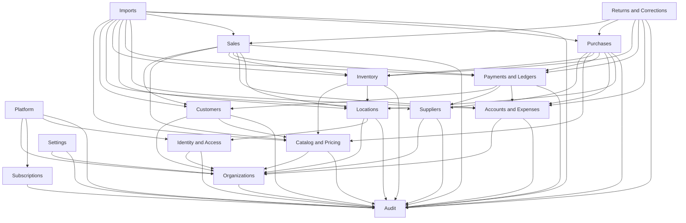
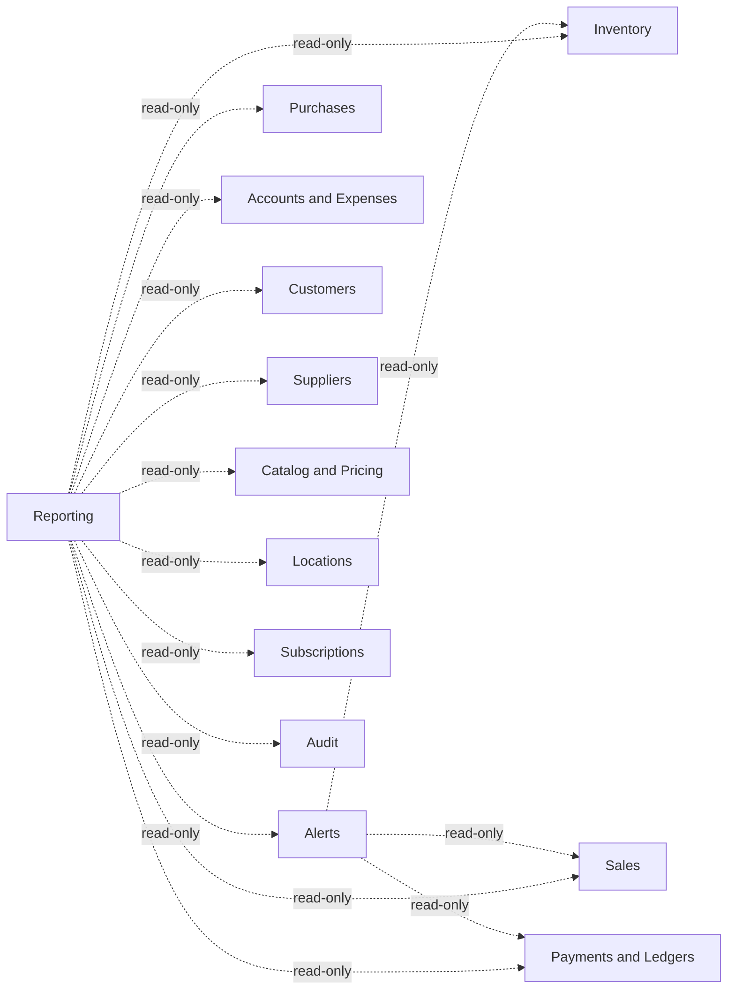

# Module Boundaries

Document status: Frozen for Release 1  
Current version: 1.1.0  
Last updated: 2026-08-05  
Approval status: Approved for Phase 1 continuation

> **Amendment 1.1.0 (2026-08-05):** Frontend canonical project: `apps/frontend`. Backend canonical project: `apps/backend`. Backend implementation language: JavaScript ESM. Frontend implementation language: Angular TypeScript. Details: [tasks/F00-APP-NAMING-BACKEND-JS-MIGRATION.md](tasks/F00-APP-NAMING-BACKEND-JS-MIGRATION.md).

## Document Authority

| Concern | Authoritative document |
| --- | --- |
| What Release 1 must provide | Frozen [PRD.md](PRD.md) |
| Business behaviour and formulas | Frozen [BUSINESS_RULES.md](BUSINESS_RULES.md) |
| How modules are structured and may depend | This document |
| System architecture | [ARCHITECTURE.md](ARCHITECTURE.md) |
| Target repository layout | [REPOSITORY_STRUCTURE.md](REPOSITORY_STRUCTURE.md) |

Architecture documents define how the system will be structured to support frozen requirements. This document does not add product scope, change business rules, or create implementation.

P1-04 does not create application code, frameworks, packages, source folders, schemas, APIs, or tests.

---

## 1. Canonical Module Catalog

Release 1 backend modules:

| # | Module | Folder slug |
| --- | --- | --- |
| 1 | Platform | `platform` |
| 2 | Identity and Access | `identity-access` |
| 3 | Organizations | `organizations` |
| 4 | Subscriptions | `subscriptions` |
| 5 | Locations | `locations` |
| 6 | Catalog and Pricing | `catalog` |
| 7 | Customers | `customers` |
| 8 | Suppliers | `suppliers` |
| 9 | Inventory | `inventory` |
| 10 | Purchases | `purchases` |
| 11 | Sales | `sales` |
| 12 | Payments and Ledgers | `payments-ledgers` |
| 13 | Accounts and Expenses | `accounts-expenses` |
| 14 | Returns and Corrections | `returns-corrections` |
| 15 | Alerts | `alerts` |
| 16 | Reporting | `reporting` |
| 17 | Imports | `imports` |
| 18 | Audit | `audit` |
| 19 | Settings | `settings` |
| 20 | Operations | `operations` |

Exact internal file count is not defined in P1-04.

---

## 2. Module Responsibilities and Ownership

### 2.1 Platform

**Owns:** Super Admin platform operations; organization approval orchestration; platform-level operational views; platform scope boundaries.

**Does not own:** Organization business data.

**Data ownership:** Platform operational records that are not tenant business ledgers, stock, or organization commercial master data.

**PRD prefixes:** `FR-PLATFORM-*`, `FR-ORG-001`, `FR-ORG-002`, related platform portions of `FR-AUTH-004`  
**Business-rule prefixes:** `BR-ORG`

### 2.2 Identity and Access

**Owns:** Authentication identity; sessions; password reset; permission evaluation; user authentication context.

**Does not own:** Organization subscription entitlements.

**Data ownership:** Credentials, sessions, permission assignments, authentication context artifacts.

**PRD prefixes:** `FR-AUTH-*`, `FR-USER-*`  
**Business-rule prefixes:** `BR-ORG`

### 2.3 Organizations

**Owns:** Organization lifecycle; organization profile; Owner-presence invariant; organization-level settings references.

**Does not own:** Employee authentication credentials.

**Data ownership:** Organization master records and organization lifecycle state.

**PRD prefixes:** `FR-ORG-*`  
**Business-rule prefixes:** `BR-ORG`

### 2.4 Subscriptions

**Owns:** Plans; subscription state; trial; grace; suspension; reactivation; entitlements; plan-limit evaluation; manual billing verification status.

**Data ownership:** Plan definitions, subscription state, entitlement evaluation inputs, manual billing verification records.

**PRD prefixes:** `FR-SUB-*`  
**Business-rule prefixes:** `BR-SUB`

### 2.5 Locations

**Owns:** Branches; warehouses; employee branch assignments; employee warehouse assignments; branch invoice-prefix configuration.

**Does not own:** Stock quantities.

**Data ownership:** Branch and warehouse master data; assignment records; invoice-prefix configuration.

**PRD prefixes:** `FR-BRANCH-*`, `FR-WAREHOUSE-001`, `FR-WAREHOUSE-002`, `FR-USER-003`  
**Business-rule prefixes:** `BR-ORG`

### 2.6 Catalog and Pricing

**Owns:** Product categories; products; base units; packaging units; conversion configuration; tracking modes; price tiers; product prices.

**Does not own:** Posted transaction snapshots or current stock.

**Data ownership:** Category, product, unit, conversion, tracking-mode, and price master data.

**PRD prefixes:** `FR-PRODUCT-*`  
**Business-rule prefixes:** `BR-UNIT`, `BR-BATCH`

### 2.7 Customers

**Owns:** Customer records; customer type; credit policy; credit-limit configuration; customer opening receivable/advance source request facts.

**Does not own:** Posted sales invoices or posted ledger effects.

**Data ownership:** Customer master data, credit-policy configuration, and opening receivable/advance source-request facts. Payments and Ledgers applies corresponding ledger effects through its public interfaces.

**PRD prefixes:** `FR-CUSTOMER-001` to `FR-CUSTOMER-004`, related pricing customer-type fields in `FR-PRODUCT-010` / `FR-PRODUCT-011`  
**Business-rule prefixes:** `BR-SALE`, `BR-LEDGER`

### 2.8 Suppliers

**Owns:** Supplier records; supplier opening payable/advance source request facts; supplier reference information.

**Does not own:** Purchases or posted ledger effects.

**Data ownership:** Supplier master data and opening payable/advance source-request facts. Payments and Ledgers applies corresponding ledger effects through its public interfaces.

**PRD prefixes:** `FR-SUPPLIER-001`  
**Business-rule prefixes:** `BR-PURCHASE`, `BR-LEDGER`

### 2.9 Inventory

**Owns:** Stock movements; warehouse stock; batch stock; expiry facts; FEFO/FIFO allocation; weighted-average cost; stock valuation; stock adjustments; warehouse transfers.

Inventory balances are movement-derived.

**Data ownership:** Stock movements, warehouse/batch stock state, cost and valuation state owned by inventory rules.

**PRD prefixes:** `FR-INVENTORY-*`, `FR-WAREHOUSE-003`  
**Business-rule prefixes:** `BR-INVENTORY`, `BR-BATCH`, `BR-COST`, `BR-TRANSFER`

### 2.10 Purchases

**Owns:** Purchase drafts; posted purchases; supplier-reference duplicate checks; purchase posting orchestration; purchase cancellation orchestration; purchase-return source validation.

Purchases must use Inventory, Payments and Ledgers, Accounts and Expenses, and Audit through public interfaces.

**Data ownership:** Purchase drafts and posted purchase records and purchase-owned snapshots.

**PRD prefixes:** `FR-PURCHASE-*`  
**Business-rule prefixes:** `BR-PURCHASE`, `BR-COST`, `BR-COMMON`

### 2.11 Sales

**Owns:** Sale drafts; posted invoices; invoice sequencing; sale posting orchestration; credit-sale validation orchestration; sale cancellation orchestration; posted sale-price and cost snapshots.

Sales must use Inventory, Customers, Payments and Ledgers, Accounts and Expenses, and Audit through public interfaces.

**Data ownership:** Sale drafts, posted invoices, invoice sequence state, sale-owned price/cost snapshots.

**PRD prefixes:** `FR-SALE-*`  
**Business-rule prefixes:** `BR-SALE`, `BR-COMMON`

### 2.12 Payments and Ledgers

**Owns:** Customer payments; supplier payments; payment allocations; customer advances; supplier advances; receivable effects; payable effects; customer ledger; supplier ledger; payment correction.

**Does not own:** Account balances or account movements.

**Data ownership:** Payment records, allocations, advances, and signed ledger effects.

**PRD prefixes:** `FR-PAYMENT-*`, `FR-CUSTOMER-005`, `FR-SUPPLIER-002`  
**Business-rule prefixes:** `BR-PAYMENT`, `BR-LEDGER`

### 2.13 Accounts and Expenses

**Owns:** Cash accounts; bank accounts; JazzCash accounts; Easypaisa accounts; account movements; account transfers; opening account balances; expense categories; expenses; expense correction.

Account balances are movement-derived.

**Data ownership:** Account master data, account movements, expense categories, expenses.

**PRD prefixes:** `FR-ACCOUNT-*`, `FR-EXPENSE-*`  
**Business-rule prefixes:** `BR-ACCOUNT`, `BR-EXPENSE`

### 2.14 Returns and Corrections

**Owns:** Sales-return orchestration; purchase-return orchestration; return-without-invoice approval flow; sellable/unsellable classification; refund or ledger-adjustment orchestration; shared correction workflow conventions.

It must use the source Sale or Purchase module rather than recreating source transaction logic.

**Data ownership:** Return and correction orchestration records and return-owned classification/approval facts.

**PRD prefixes:** `FR-RETURN-*`  
**Business-rule prefixes:** `BR-RETURN`, `BR-CORRECTION`

### 2.15 Alerts

**Owns:** Low-stock, expiry, expired-stock, dead-stock, customer-due, and supplier-due alert queries; in-app notification presentation data.

Alerts do not own authoritative stock or ledger balances.

**Data ownership:** Alert presentation/query results and alert-facing configuration references that are not owned by a specialized domain module.

**PRD prefixes:** `FR-ALERT-*`, `FR-INVENTORY-013` (threshold presentation coordination)  
**Business-rule prefixes:** `BR-ALERT`

**Configuration ownership note:** Expiry threshold configuration belongs to Inventory or Alerts according to the approved ownership table below; authoritative stock remains Inventory.

| Setting | Owning module |
| --- | --- |
| Credit policy | Customers |
| Expiry alert thresholds | Inventory (authoritative product/stock facts) with Alerts consuming query interfaces |
| Subscription settings | Subscriptions |

### 2.16 Reporting

**Owns:** Dashboard query composition; fixed report query composition; report filters; report exports; reconciliation-oriented report views.

Reporting is read-only. It must not post stock, payment, ledger, account, or correction effects.

**Data ownership:** No authoritative transactional ownership; composed read models and export artifacts only.

**PRD prefixes:** `FR-REPORT-*`  
**Business-rule prefixes:** `BR-REPORT`

### 2.17 Imports

**Owns:** Import job lifecycle; template version recognition; preview validation; row and field error reporting; import orchestration; import-result audit references.

Imports must invoke target-module application interfaces. Imports must not directly write another module’s collections or repositories.

**Data ownership:** Import jobs, preview/error reports, import-result references.

**PRD prefixes:** `FR-IMPORT-*`  
**Business-rule prefixes:** `BR-IMPORT`

### 2.18 Audit

**Owns:** Audit-event persistence; audit query access; actor, reason, approval, and source references.

Audit does not replace technical logs.

Business modules must create audit events through the Audit public interface.

**Data ownership:** Audit events.

**PRD prefixes:** `FR-AUDIT-*`  
**Business-rule prefixes:** `BR-AUDIT`

### 2.19 Settings

**Owns:** Organization-configurable operational settings not owned by a specialized module; references to configured policies.

A setting already owned by a domain module remains with that module.

**Data ownership:** Residual organization settings not claimed by Customers, Inventory/Alerts, Subscriptions, Locations, or other specialized owners.

**PRD prefixes:** `FR-SETTINGS-001`, `FR-ORG-005`  
**Business-rule prefixes:** None dedicated. Settings residual configuration is governed by owning-domain BR prefixes where a specialized module owns the policy.

### 2.20 Operations

**Owns:** Health checks; backup-status visibility; restore-operation coordination; operational readiness; error-monitoring integration; structured logging integration.

Operations does not own business audit records.

**Data ownership:** Operational status and integration configuration surfaces; not business ledgers or stock.

**PRD prefixes:** `FR-SETTINGS-002` to `FR-SETTINGS-007`, `NFR-OBS-*`, `NFR-BACKUP-*`  
**Business-rule prefixes:** None dedicated.

**Operational database access boundary:**

* Operations may access database infrastructure for controlled backup, restore, health, migration, and authorized emergency procedures.
* Operations must not bypass application services for normal business transactions.
* Direct mutation of posted sales, purchases, stock, ledgers, payments, accounts, or audit records is prohibited as a normal operational workflow.
* Emergency repair requires an authorized incident procedure, recovery plan, incident record, and reconciliation.
* Detailed incident runbooks are out of scope for P1-04.

---

## 3. Public Module Interfaces

Every business module must expose a deliberate public surface.

Other modules may use only:

* Public application interface
* Public query interface
* Published domain type or contract
* Approved after-commit event

Other modules must not import:

* Internal controller
* Internal service implementation
* Internal repository
* Mongoose model
* Persistence mapper
* Internal validator
* Private utility
* Internal folder path

The public interface may later be represented through an explicit module entry point such as `modules/<module>/public/`.

Exact TypeScript interface definitions belong in P1-05 or implementation tasks.

---

## 4. Allowed Dependencies

The allowed-dependency matrix is authoritative. Diagrams must match it. Dependencies are separated into authoritative write, approved read-only, and infrastructure-only.

Direction means “may call public interfaces of”.

### 4.1 Authoritative write dependencies

These edges may participate in mutating business workflows and transactional orchestration.

| From module | May depend on (write / orchestration) |
| --- | --- |
| Platform | Organizations; Subscriptions; Identity and Access; Audit |
| Identity and Access | Organizations; Audit |
| Organizations | Audit |
| Subscriptions | Audit |
| Locations | Organizations; Identity and Access; Audit |
| Catalog and Pricing | Organizations; Audit |
| Customers | Organizations; Catalog and Pricing; Audit |
| Suppliers | Organizations; Audit |
| Inventory | Catalog and Pricing; Locations; Audit |
| Purchases | Suppliers; Catalog and Pricing; Inventory; Payments and Ledgers; Accounts and Expenses; Locations; Audit |
| Sales | Customers; Catalog and Pricing; Inventory; Payments and Ledgers; Accounts and Expenses; Locations; Audit |
| Returns and Corrections | Sales; Purchases; Inventory; Payments and Ledgers; Accounts and Expenses; Audit |
| Payments and Ledgers | Customers; Suppliers; Accounts and Expenses; Audit |
| Accounts and Expenses | Organizations; Audit |
| Imports | Catalog and Pricing; Customers; Suppliers; Inventory; Locations; Payments and Ledgers; Accounts and Expenses; Sales; Purchases; Audit |
| Audit | None |
| Settings | Organizations; Audit |
| Alerts | None (read-only only; see §4.2) |
| Reporting | None (read-only only; see §4.2) |
| Operations | None (infrastructure-only; see §4.3) |

Opening receivable/payable and advance source-request facts are owned by Customers or Suppliers. Payments and Ledgers applies corresponding ledger effects by consuming those public interfaces. Platform orchestrates organization approval with Subscriptions and Identity without creating Organizations ↔ Subscriptions write cycles. Organization and subscription records may store foreign identifiers without importing each other’s internal modules.

### 4.2 Approved read-only dependencies

These edges may query published read interfaces only. They must not mutate authoritative stock, ledger, payment, account, or correction state.

| From module | May depend on (read-only) |
| --- | --- |
| Alerts | Inventory; Payments and Ledgers; Sales |
| Reporting | Inventory; Sales; Purchases; Payments and Ledgers; Accounts and Expenses; Customers; Suppliers; Catalog and Pricing; Locations; Alerts; Subscriptions; Audit |

### 4.3 Infrastructure-only dependencies

| From module | May depend on |
| --- | --- |
| Operations | Database and hosting infrastructure for backup, restore, health, migration, monitoring, and logging; operational status interfaces |
| Platform | Operations operational-status interfaces only (not business-data mutation) |

Operations must not depend on business modules for normal transactional work and must not bypass application services for normal business transactions.

---

## 5. Forbidden Dependencies

Prohibited:

* Circular module dependencies
* Controller-to-controller calls
* Repository-to-controller calls
* Repository-to-service calls outside its module
* Direct Mongoose access from controllers
* Direct Mongoose access from frontend code
* One module importing another module’s Mongoose model
* One module importing another module’s repository
* One feature importing another feature’s internal frontend files
* Audit module depending on every business module
* Reporting module mutating business data
* Alerts module becoming source of truth for stock or ledgers
* Imports writing directly to another module’s persistence layer
* Shared packages containing product-specific business rules
* Generic `common`, `utils`, or `helpers` folders becoming unowned dumping grounds
* Business modules depending on HTTP request or response objects
* Domain calculations inside route middleware
* Client-specific branches in business logic
* Dedicated-cloud-only product behaviour
* Cross-tenant queries without explicit platform authorization
* Operational modules depending on Reporting
* Inventory depending on Sales or Purchases
* Customers or Suppliers depending on Sales or Purchases for master-data ownership
* Payments and Ledgers creating account movements during a Sale- or Purchase-owned workflow
* Duplicate adjacent effects inferred by a participant instead of requested by the orchestrator

Architecture tests must later enforce these rules by failing builds on forbidden imports, cross-module model/repository imports, controller persistence access, missing organization scope on tenant repositories, and detected circular dependencies.

---

## 6. Module Dependency Graphs

### 6.1 Authoritative write graph

Scope: every edge from §4.1. Solid edges are authoritative write/orchestration dependencies. This graph is complete for §4.1 and is acyclic.

### 6.2 Approved read-only graph

Scope: every edge from §4.2. Dotted edges are read-only. This graph is complete for §4.2.

### 6.3 Infrastructure-only dependencies

Scope: §4.3. Not shown as business-module write edges.

* Operations → database/hosting infrastructure and operational status interfaces
* Platform → Operations operational-status interfaces only

### Cyclic-dependency prevention

* Write-path dependencies flow from orchestrators (Sales, Purchases, Returns, Imports) toward foundational modules (Inventory, Payments, Accounts, Catalog, Locations, Audit).
* Foundational modules must not depend upward on Sales, Purchases, Returns, Reporting, or Imports.
* Payments and Ledgers may call Customers and Suppliers public interfaces; Customers and Suppliers must not depend on Payments.
* Organizations and Subscriptions must not depend on each other; Platform orchestrates cross-cutting onboarding and approval.
* Audit is a sink for audit writes; Audit must not depend on business modules.
* Reporting and Alerts are read-only consumers and must not be depended upon by operational write modules for mutation.
* Imports call outward to target public application interfaces and must not be depended upon by those targets.
* Operations must not create business-module dependency cycles.

If a proposed feature would create a cycle, ownership must be redesigned or an ADR raised before implementation.

---

## 7. Cross-Module Transaction Rules

Business-critical workflows must execute synchronously inside one database transaction where required by frozen business rules and PRD atomicity requirements (`NFR-DATA-001`, `FR-SALE-019`, `FR-SALE-020`, `FR-PURCHASE-006`, `FR-PURCHASE-016`, return and transfer atomicity).

| Workflow | Orchestrating module | Participating public interfaces |
| --- | --- | --- |
| Sale posting | Sales | Inventory; Customers; Payments and Ledgers; Accounts and Expenses; Audit; Locations/Catalog as needed |
| Purchase posting | Purchases | Inventory; Suppliers; Payments and Ledgers; Accounts and Expenses; Audit; Catalog/Locations as needed |
| Return posting | Returns and Corrections | Sales or Purchases; Inventory; Payments and Ledgers; Accounts and Expenses; Audit |
| Warehouse transfer | Inventory | Locations; Audit |
| Standalone customer/supplier payment | Payments and Ledgers | Customers or Suppliers; Accounts and Expenses; Audit |
| Expense posting | Accounts and Expenses | Audit |

### Payment and account effect ownership

#### Sale and purchase posting

* Sales or Purchases owns the transaction boundary.
* Payments and Ledgers creates payment allocations and signed receivable/payable effects when requested by the orchestrator.
* Accounts and Expenses creates account movements when requested by the orchestrator.
* Participating modules must not duplicate effects delegated to another module.
* Payments and Ledgers must not create a second account movement during a Sale- or Purchase-owned workflow.

#### Standalone customer or supplier payment

* Payments and Ledgers owns orchestration.
* Payments and Ledgers invokes Accounts and Expenses exactly once through its public interface for the required account movement.
* The payment, allocation, ledger, account, and audit effects participate in one transaction.

#### General rule

A participating module performs only the effects requested through the orchestrator’s public command. It must not infer and repeat adjacent effects owned by another participating module.

### Shared transaction rules

* The use-case-owning service controls the transaction boundary.
* Participating module interfaces must accept the shared transaction context.
* Participating modules must not commit independently.
* A failed workflow must roll back all authoritative effects.
* Audit events required by the transaction must participate in the same transaction.
* After-commit actions must not determine authoritative stock or financial state.

Do not define Mongoose session APIs in this task.

---

## 8. Cross-Module Query Rules

* Prefer published query interfaces of the owning module.
* Reporting and Alerts may compose cross-module read-only queries without mutating owned data.
* Query consumers must remain organization scoped.
* Query consumers must not import foreign repositories or Mongoose models.
* Reconciliation views must derive from authoritative movements and posted transactions, not conflicting parallel totals.

---

## 9. Reporting Exceptions

Reporting may:

* Aggregate across approved read-only query interfaces
* Host dedicated read-only reporting queries for cross-module composition
* Export PDF, Excel, and CSV where tabular export is appropriate

Reporting must not:

* Post stock, payment, ledger, account, or correction effects
* Become the source of truth for balances
* Be imported by operational write modules

---

## 10. Import Orchestration Rules

* Import owns orchestration, not target business data.
* Target modules remain responsible for their own business rules.
* Imports must not bypass service-layer validation.
* Imports must not directly call another module’s Mongoose model or repository.
* Imports must not silently overwrite records.
* Import execution must be logically all-or-nothing according to frozen business rules.
* Import results and audit references remain import-owned; business effects remain target-module-owned.

---

## 11. Audit Ownership

* Audit owns persistence and query of audit events.
* Business modules create audit events through the Audit public interface.
* Required transactional audit events participate in the same database transaction as the business effects.
* Audit does not replace technical logs owned by Operations/infrastructure.
* Audit queries remain tenant-scoped except explicitly authorized platform operations.

---

## 12. Architecture Enforcement Expectations

Later architecture tests and review gates must verify:

* No forbidden module imports
* No cross-module model imports
* No cross-module repository imports
* No controller persistence access
* No frontend feature-internal cross-imports
* Every tenant-owned repository requires organization scope
* No circular dependencies
* Reporting remains read-only
* Imports call public application interfaces only
* Critical workflows retain documented transaction ownership
* Sale/Purchase-owned workflows do not allow Payments and Ledgers to create duplicate account movements

Exact tooling belongs in P1-07 or implementation tasks.
